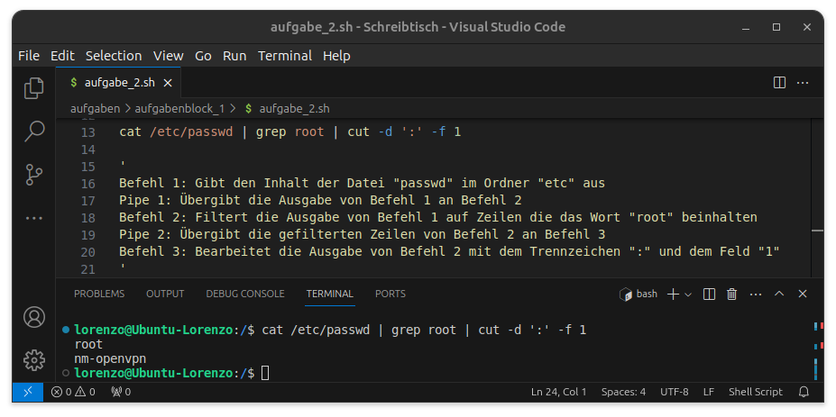
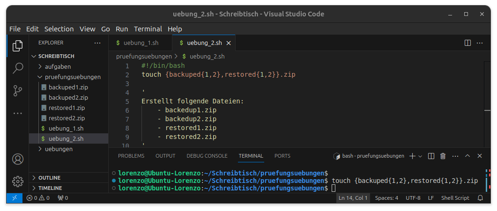
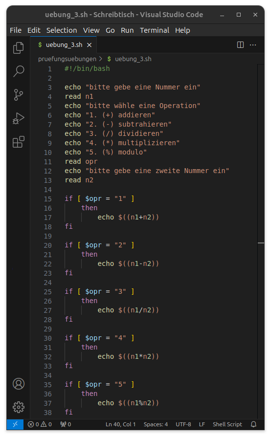
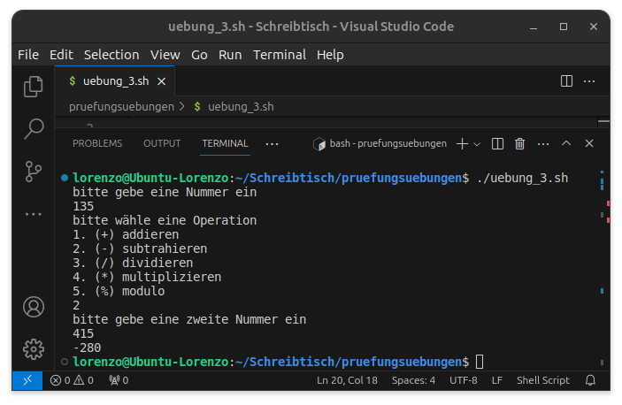
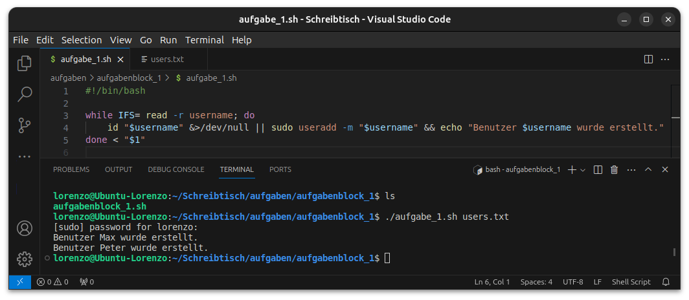

# 2024-04-11 | Prüfungsübungen

## Übunge 1


# 2024-04-04 | Prüfungsübungen

## Übung 1

Erkläre was dieser Befehl ausführt:

```bash
cat /etc/passwd | grep root | cut -d ':' -f 1
```

### Lösung:

```bash
cat /etc/passwd
# Gibt den Inhalt der Datei "passwd" im Ordner "etc" aus
```

```bash
grep root
# Filtert die Ausgabe von Befehl 1 auf Zeilen die das Wort "root" beinhalten
```

```bash
cut -d ':' -f 1
# Bearbeitet die Ausgabe von Befehl 2 mit dem Trennzeichen ":" und dem Feld "1"
```

**Ausgabe:**



## Übung 2:

Erkläre was dieser Befehl ausführt:

```bash
touch {backuped{1,2},restored{1,2}}.zip
```

### Lösung

Der Befehl erstellt folgende Dateien:
- backedup1.zip
- backedup2.zip
- restored1.zip
- restored2.zip



## Übung 3

Gegeben ist folgendes Taschenrechnerscript:

```bash
echo "bitte gebe eine Nummer ein"
read n1
echo "bitte wähle eine Operation"
echo "1. (+) addieren"
echo "2. (-) subtrahieren"
echo "3. (/) dividieren"
echo "4. (*) multiplizieren"
echo "5. (%) modulo"
read opr
echo "bitte gebe eine zweite Nummer ein"
read n2

if [ $opr = "1" ]
    then
        echo $((n1+n2))

if [ $opr = "3" ]
    then
        echo $((n1/n2))
```

Füge den fehlenden Code hinzu

### Lösung:

**Code:**



**Terminal:**



***

# 2024-03-28 | 04 - Bash Aufgaben

## Aufgabe 1

**Aufgabenstellung:**

Erzeugt Benutzer anhand einer Liste von Benutzernamen in einer Textdatei (via Parameter angegebenen). Hinweis: Benutzen Sie `useradd` und `cat`.

**Lösung:**



## Aufgabe 2

**Aufgabenstellung:**

Fügt einen Benutzer anhand einer Liste von Gruppen in einer Textdatei (via Parameter angegebenen) den jeweiligen Gruppen hinzu. Hinweis: Benutzen Sie `groupadd` , `usermod` und `cat`. Achtung es gibt für jeden Benutzer jeweils eine `Initial login group` und mehrere `Supplementary groups`.

**Lösung:**


***

# 2024-03-14 | 03 - Bash Übungen

## Pipes

In Bash werden Pipes verwendet, um die Ausgabe eines Befehls mit der Eingabe eines anderen Befehls zu verbinden. Dadurch können Sie leistungsstarke Befehlszeilenabläufe erstellen, indem Sie mehrere Befehle miteinander verketten.

Die Syntax für die Verwendung von Pipes in Bash ist einfach. Es wird das senkrechte Strichsymbol `|` verwendet, um die Pipe anzugeben. Hier ist die grundlegende Syntax:

```
Befehl1 | Befehl2
```

Dies nimmt die Ausgabe von `Befehl1` und leitet sie als Eingabe an `Befehl2` weiter. Sie können mehrere Befehle mit Pipes verketten:

```
Befehl1 | Befehl2 | Befehl3 | ...
```

Hier ist ein Beispiel, um zu veranschaulichen, wie Pipes funktionieren:

```bash
ls -l | grep "Beispiel" | sort
```

In diesem Beispiel:

- `ls -l` listet Dateien im aktuellen Verzeichnis im Langformat auf.
- `grep "Beispiel"` filtert die Ausgabe, um nur Zeilen anzuzeigen, die das Wort "Beispiel" enthalten.
- `sort` sortiert die gefilterte Ausgabe alphabetisch.

Durch Verknüpfen dieser Befehle mit Pipes können Sie komplexe Aufgaben effizient auf der Befehlszeile erledigen. Pipes sind eine der grundlegenden Funktionen von Unix-ähnlichen Betriebssystemen und bieten eine leistungsstarke Möglichkeit, einfache Befehle zu kombinieren, um anspruchsvollere Operationen auszuführen.

## Cut

Der Befehl `cut` ist ein nützliches Werkzeug in der Befehlszeile von Unix-ähnlichen Betriebssystemen wie Linux. Er wird verwendet, um Textzeilen zu schneiden und zu extrahieren, basierend auf bestimmten Kriterien wie Zeichenpositionen oder Feldern, die durch ein Trennzeichen getrennt sind.

Die grundlegende Syntax des `cut`-Befehls lautet:

```bash
cut OPTIONEN... DATEI
```

Einige der gängigsten Optionen für den `cut`-Befehl sind:

- `-c, --characters=LIST`: Extrahiert bestimmte Zeichen basierend auf ihrer Position.
- `-f, --fields=LIST`: Extrahiert bestimmte Felder, die durch ein Trennzeichen (normalerweise Tabulatoren oder Leerzeichen) getrennt sind.
- `-d, --delimiter=ZEICHEN`: Legt das Trennzeichen fest, das für die Feldtrennung verwendet werden soll (standardmäßig ist es das Tabulatorzeichen).
- `-s, --only-delimited`: Unterdrückt Zeilen, die das Trennzeichen nicht enthalten.
- `-n`: Zeigt Zeichen oder Bytes, die durch `-c` ausgewählt wurden, numerisch an.

Ein einfaches Beispiel wäre:

```bash
cut -d ',' -f 1,3 file.csv
```

In diesem Beispiel:
- `-d ','` gibt an, dass das Trennzeichen ein Komma ist.
- `-f 1,3` fordert `cut` auf, das erste und das dritte Feld aus jeder Zeile der Datei `file.csv` zu extrahieren.

Der `cut`-Befehl ist besonders nützlich, wenn Sie Dateien mit strukturierten Daten bearbeiten und nur bestimmte Teile davon benötigen.

# 2024-03-07 | 02 - Bash Grundlagen

## Linuxbefehle
- `cd`, `ls`, `mkdir`, `rmdir`: Navigation im Dateisystem
- Dateiverwaltung: `cp`, `rm`, `mv`, `touch`, `cat`, `wc`
- Effizienzsteigerung durch Aliase, Wildcards und Brace-Expansion

## Shellprogrammierung
- Variablen, arithmetische Operatoren, Zeichenkettenverarbeitung
- Kontrollstrukturen: `for`, `while`, `until`, `if`, `case`
- Praktische Beispiele und Übungen zur Festigung des Verständnisses

##  Script erstellen und ausführen
1. Terminal öffnen und mit `cd *Verzeichnis*` in das gewünschte Verzeichnis wechseln
2. Script mit `touch *Dateiname*.sh` erstellen
3. Script mit `chmod +x *Dateiname*.sh` ausführbar machen
4. Script mit `./*Dateiname*.sh` ausführen

### Beispiel:

```bash
cd Schreibtisch
touch test.sh
chmod +x test.sh
```

## Rechte und Benutzerverwaltung
- Zugriffsrechte: `chmod`
- Benutzer- und Gruppenverwaltung: `chown`, `chgrp`

### Beispiel:

```bash
chmod u=rw,g=rw,o=r datei.txt
chown neuerbenutzer datei.txt
chgrp neuegruppe datei.txt
```

## Exkurs: Reguläre Ausdrücke und Textverarbeitungstools
- Suche in Texten mit regulären Ausdrücken
- Textverarbeitungstools: `grep`, `cut`, `sed`, `awk`, `xargs`

## Zusammenfassung und Lernprozess
- Schrittweises Durcharbeiten der Themen mit praktischen Übungen
- Kombination aus theoretischem Verständnis und praktischer Anwendung
- Vertiefung des Wissens durch zusätzliche Ressourcen wie das Openbook "Shell Programmierung"

## Persönliches Fazit und Ausblick
- Erfolgreiches Erlernen und Anwenden der BASH-Scripting-Grundlagen
- Nächste Schritte: Anwendung in praxisorientierten Projekten, Vertiefung fortgeschrittener Konzepte wie Funktionen und Skriptoptimierung
- Stärkung des Vertrauens durch regelmässiges Üben und Arbeiten an realen Anwendungen

***

# 2024-03-07 | 01 - Linux Einführung

## Linux-Geschichte
Linux wurde von Linus Torvalds als Neugierprojekt gestartet und hat sich seitdem zu einem vielseitigen Betriebssystem entwickelt, das von einer Vielzahl von Entwicklern unterstützt wird.

## Linux-Installation
- Möglichkeiten der Installation auf verschiedenen Plattformen wie iOS-Smartphones, Android-Smartphones, Windows und MacOS.

- Empfehlung zur Installation einer virtuellen Maschine (VM) für eine eigenständige Linux-Umgebung.

- Vorstellung von Linux-Distributionen wie Debian und Ubuntu, einschliesslich der Installationsschritte.

- Einführung in die Linux-Verzeichnishierarchie mit wichtigen Verzeichnissen wie /bin, /dev, /etc, /home, /lib, /opt, /run, /sbin, /tmp, /usr und /var.

- Checkpoint für den Fortschritt, einschliesslich der Bestätigung der Linux-Herkunft, der erfolgreichen Installation einer Distribution und der Durchführung der ersten Schritte nach der Installation.