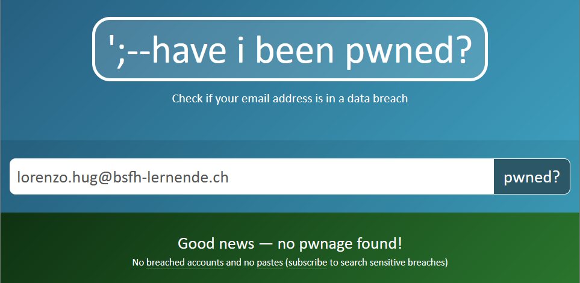

# 03 - Passwörter

## 05 - MFA
Multifaktorauthentifizierung (MFA) ist eine Methode zur Absicherung von Benutzerkonten, die mehr als nur ein Authentifizierungsmerkmal erfordert. Anstatt sich lediglich auf ein einziges Merkmal wie ein Passwort zu verlassen, kombiniert MFA mehrere Faktoren, um die Identität des Benutzers zu verifizieren. Diese Faktoren können in drei Hauptkategorien unterteilt werden:

1. **Wissen**: Etwas, das der Benutzer weiß (z.B. Passwort, PIN).

2. **Besitz**: Etwas, das der Benutzer besitzt (z.B. Smartphone, Sicherheits-Token).

3. **Inhärenz**: Etwas, das der Benutzer ist (z.B. Fingerabdruck, Gesichtserkennung).

### Beispiel eines MFA-Prozesses:
1. **Erster Faktor – Wissen**: Der Benutzer gibt sein Passwort ein.

2. **Zweiter Faktor – Besitz**: Der Benutzer erhält einen Einmalcode auf sein Smartphone, den er eingeben muss.

3. **Dritter Faktor – Inhärenz**: In einigen Fällen kann auch eine biometrische Verifizierung wie Fingerabdruckscan oder Gesichtserkennung erforderlich sein.

### Vorteile von MFA:
- **Erhöhte Sicherheit**: Durch die Kombination mehrerer Authentifizierungsfaktoren wird es für Angreifer schwieriger, auf ein Konto zuzugreifen, selbst wenn ein Faktor kompromittiert ist.

- **Schutz vor verschiedenen Angriffstypen**: MFA kann Schutz vor Phishing, Passwort-Diebstahl und Brute-Force-Angriffen bieten.

- **Erfüllung von Compliance-Anforderungen**: Viele Branchen und Regularien erfordern mittlerweile die Nutzung von MFA, um den Datenschutz zu gewährleisten.

### Implementierung von MFA:
1. **Wahl der MFA-Methoden**: Unternehmen wählen die für sie geeigneten MFA-Methoden basierend auf ihren Sicherheitsanforderungen und der Benutzerfreundlichkeit.
2. **Integration in Systeme**: MFA muss in bestehende IT-Systeme und Anwendungen integriert werden, oft durch die Nutzung von API-Schnittstellen und Authentifizierungsdiensten.
3. **Schulung der Benutzer**: Benutzer müssen über die Verwendung von MFA informiert und geschult werden, um sicherzustellen, dass sie die zusätzlichen Schritte verstehen und durchführen können.

MFA ist eine effektive Sicherheitsmaßnahme, die das Risiko von unautorisiertem Zugriff erheblich reduziert und somit die Sicherheit von Benutzerkonten und sensiblen Daten verbessert.

***

## 04 - Have I been pwned?

***