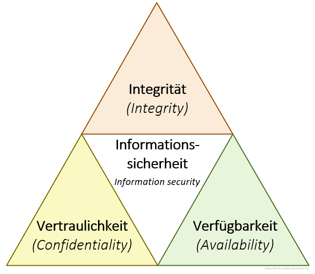

# Datensicherheit und Datenschutz

>[!NOTE]
Der Unterschied zwischen Datenschutz und Datensicherheit liegt in ihren Schwerpunkten und Zielen. Datensicherheit konzentriert sich auf technische und organisatorische Maßnahmen, um Daten vor Bedrohungen wie Manipulation, unbefugtem Zugriff und Ausfall zu schützen. Die Hauptziele der Datensicherheit, gemäß der CIA-Triad, umfassen Verfügbarkeit, Vertraulichkeit und Integrität der Daten.

## Datensicherheit

- Verfügbarkeit: Gewährleistung, dass Daten innerhalb eines festgelegten Zeitraums verfügbar sind und Systemausfälle vermieden werden.

- Vertraulichkeit: Sicherstellung, dass Daten nur von autorisierten Benutzern gelesen oder geändert werden können, sowohl während der Speicherung als auch bei der Übertragung.

- Integrität: Sicherstellung, dass Daten nicht unbemerkt verändert werden und alle Änderungen nachvollziehbar sind.

## Datenschutz

Datenschutz hingegen bezieht sich auf den Schutz personenbezogener Daten und umfasst rechtliche und ethische Aspekte. Dies kann den Schutz vor missbräuchlicher Datenverarbeitung, die Sicherung des Rechts auf informationelle Selbstbestimmung, den Schutz der Privatsphäre und anderer Persönlichkeitsrechte umfassen.

> [!IMPOTANT]
Insgesamt kann man sagen, dass Datensicherheit sich auf technische und organisatorische Maßnahmen konzentriert, um Daten zu schützen, während Datenschutz sich auf rechtliche und ethische Aspekte des Schutzes personenbezogener Daten konzentriert.

***

# 2024-03-07 | 03 - Herausforderungen in der digitalen Welt

## Gruppenarbeit

>[!NOTE]
In Bezug auf die Thematik selbstfahrender Autos und der Frage der Haftung bei Unfällen stehen verschiedene ethische und rechtliche Fragen im Raum.

### 1. Haftung
- Die Frage nach der Haftung bei Unfällen mit selbstfahrenden Autos ist komplex und noch nicht abschließend geklärt. Es könnte sein, dass die Hersteller der Fahrzeuge, die Softwareentwickler oder sogar die Fahrzeughalter in Frage kommen könnten, je nach den Umständen des Unfalls und den geltenden Gesetzen.

### 2. Ethik:
- Im Szenario eines bevorstehenden Unfalls stellt sich die ethische Frage, ob das Auto die Insassen schützen sollte oder die Fußgänger. Diese Entscheidung könnte Leben retten, aber auch moralische Dilemmata aufwerfen.

- Die erste Möglichkeit, in einen Baum zu fahren, um den Fußgänger zu retten, könnte ethisch gerechtfertigt sein, da sie die Lebensrettung priorisiert, aber gleichzeitig die Insassen gefährdet.

- Die zweite Möglichkeit, nicht auszuweichen, könnte die Insassen schützen, aber auf Kosten des Fußgängers gehen.

### 3. Entscheidungsfindung:
- Selbstfahrende Autos müssen möglicherweise in der Lage sein, in Echtzeit komplexe ethische Entscheidungen zu treffen. Die Programmierung dieser Entscheidungen könnte eine große Herausforderung darstellen und erfordert möglicherweise eine umfassende rechtliche und ethische Rahmenbedingungen.

### 4. Gesellschaftliche Debatte:
- Diese Fragen erfordern eine breite gesellschaftliche Debatte und möglicherweise neue Gesetze oder Richtlinien, um solche Situationen angemessen zu regeln.

>[!IMPORTANT]
Insgesamt ist die Frage der Haftung und ethischen Entscheidungsfindung bei Unfällen mit selbstfahrenden Autos eine komplexe und noch nicht vollständig gelöste Problematik, die weiterhin Diskussion und Forschung erfordert.