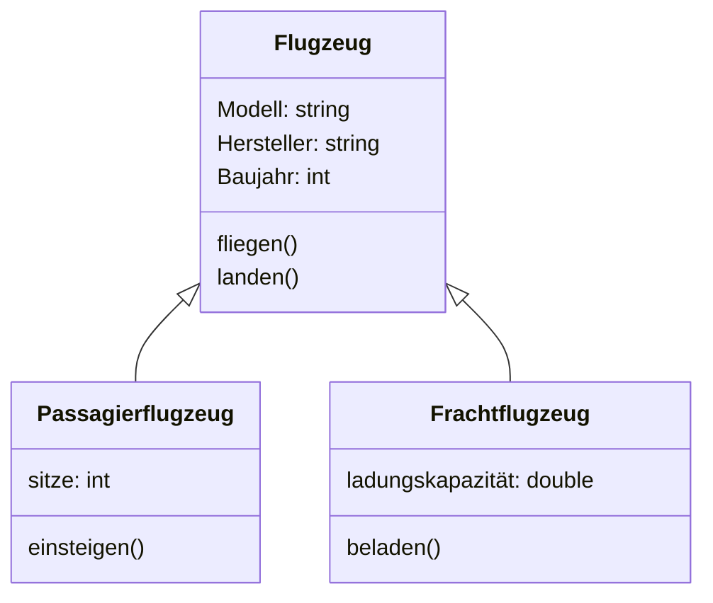
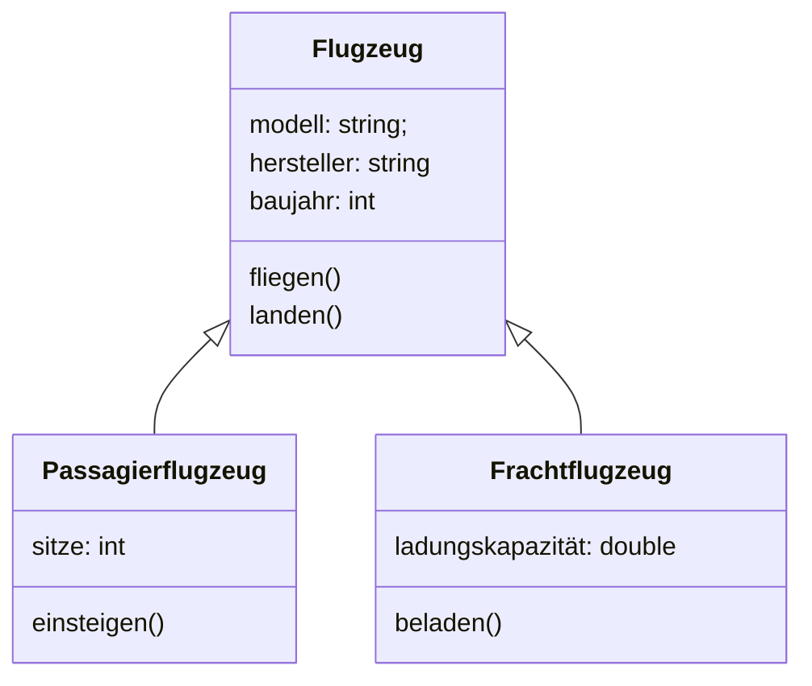

### Klasse
Eine **Klasse** ist ein Bauplan oder Template, um Objekte zu erstellen. Sie definiert Eigenschaften (Attribute) und Verhalten (Methoden), die die Objekte besitzen.  
**Beispiel (C#):**
```java
public class Auto {
    public string Marke;
    public int Baujahr;
}
```

### Attribut
Ein **Attribut** ist eine Variable innerhalb einer Klasse, die den Zustand eines Objekts beschreibt.  
**Beispiel (C#):**
```java
public class Auto {
    public string Marke;  // Attribut
    public int Baujahr;   // Attribut
}
```

### Methode
Eine **Methode** ist eine Funktion, die innerhalb einer Klasse definiert wird und das Verhalten der Objekte beschreibt.  
**Beispiel (C#):**
```java
public void Start() {
    System.out.println("Das Auto startet.");
}
```

### Constructor
Der **Konstruktor** ist eine spezielle Methode, die beim Erstellen eines Objekts aufgerufen wird, um dessen initialen Zustand zu setzen.  
**Beispiel:**
```java
public Auto(String marke, int baujahr) {
    this.marke = marke;
    this.baujahr = baujahr;
}
```

### Eigenschaften
**Eigenschaften** sind eine Kombination aus Attributen und Methoden. Sie bieten eine kontrollierte Möglichkeit, auf die Werte von Attributen zuzugreifen und sie zu verändern.  
**Beispiel (C#):**
```java
private String marke;

public String getMarke() {
    return marke;
}

public void setMarke(String marke) {
    this.marke = marke;
}
```

### Klasse identifiziert sich...
Eine **Klasse identifiziert sich** durch ihren Namen und ihre Definition. Sie beschreibt das Baugerüst eines Objekts und wird durch die Deklaration erkennbar.

### Objekt
Ein **Objekt** ist eine Instanz einer Klasse, also ein konkretes Exemplar, das nach dem Bauplan der Klasse erstellt wurde.  
**Beispiel (C#):**
```java
Auto meinAuto = new Auto("BMW", 2020);
```

### Identität
Die **Identität** eines Objekts ist die eindeutige Referenz, die dieses Objekt im Speicher von anderen Objekten unterscheidet.

### Zustand
Der **Zustand** eines Objekts wird durch die Werte seiner Attribute bestimmt.  
**Beispiel:**
Ein Auto-Objekt könnte den Zustand „BMW, 2020“ haben.

### Verhalten
Das **Verhalten** eines Objekts wird durch die Methoden bestimmt, die es ausführen kann.

### Wie lange bleibt die gleiche Identität erhalten?
Die **Identität** bleibt so lange erhalten, wie das Objekt im Speicher existiert. Wenn das Objekt gelöscht oder überschrieben wird, verliert es seine Identität.

### Wie lange bleibt der gleiche Zustand erhalten?
Der **Zustand** bleibt so lange erhalten, bis ein Attribut des Objekts geändert wird.

### Wie lange bleibt das gleiche Verhalten erhalten?
Das **Verhalten** eines Objekts ändert sich nicht, solange die Methoden der Klasse nicht verändert werden.

### Variable
Eine **Variable** ist ein benannter Speicherplatz, der einen Wert speichert.  
**Beispiel (C#):**
```java
int zahl = 5;
```

### Deklaration
Die **Deklaration** einer Variable gibt ihren Datentyp und ihren Namen an, aber weist ihr noch keinen Wert zu.  
**Beispiel (C#):**
```java
int zahl;
```

### Initialisierung
Die **Initialisierung** einer Variable weist ihr erstmals einen Wert zu.  
**Beispiel (C#):**
```java
int zahl = 5;
```

### Zuweisung
Die **Zuweisung** ist das Verändern des Wertes einer bereits deklarierten Variable.  
**Beispiel (C#):**
```java
zahl = 10;
```

### Instanz, Instanziierung, instanziiert
Eine **Instanz** ist ein konkretes Objekt, das aus einer Klasse erstellt wurde. **Instanziierung** ist der Prozess, bei dem ein neues Objekt erzeugt wird. Ein Objekt wird als **instanziiert** bezeichnet, wenn es erzeugt wurde.  
**Beispiel (C#):**
```java
Auto meinAuto = new Auto("BMW", 2020);
```

### Referenz
Eine **Referenz** ist ein Zeiger oder Verweis auf ein Objekt im Speicher.  
**Beispiel (C#):**
```java
Auto auto1 = new Auto("BMW", 2020);
Auto auto2 = auto1;  // auto2 referenziert auf dasselbe Objekt wie auto1
```

### referenzieren
**Referenzieren** bedeutet, auf ein bestimmtes Objekt zu verweisen. Zwei oder mehr Variablen können dasselbe Objekt referenzieren.

### Datentyp
Ein **Datentyp** gibt an, welche Art von Daten eine Variable speichern kann, z.B. `int` für Ganzzahlen oder `string` für Zeichenketten.

### Wert
Ein **Wert** ist der konkrete Inhalt, den eine Variable speichert.  
**Beispiel:**
```java
int zahl = 5;  // 5 ist der Wert
```

***

### Was ist UML?
Die **Unified Modeling Language (UML)** ist eine standardisierte grafische Sprache zur Modellierung von Softwaresystemen. Sie ermöglicht Entwicklern, komplexe Systeme durch verschiedene Diagrammtypen zu visualisieren, zu spezifizieren, zu konstruieren und zu dokumentieren. UML unterstützt die Kommunikation zwischen Stakeholdern und dient als Dokumentationswerkzeug während des gesamten Softwareentwicklungsprozesses. Die wichtigsten UML-Diagrammtypen umfassen:

- **Klassendiagramme**: Beschreiben die Struktur eines Systems durch Klassen und deren Beziehungen.
- **Objektdiagramme**: Stellen konkrete Instanzen (Objekte) und deren Beziehungen zu einem bestimmten Zeitpunkt dar.
- **Sequenzdiagramme**: Visualisieren die Interaktionen zwischen Objekten über die Zeit.
- **Aktivitätsdiagramme**: Zeigen die Abläufe innerhalb eines Systems.

### Objektdiagramm
Das Objektdiagramm zeigt konkrete Instanzen von Flugzeugen und deren Beziehungen. In diesem Beispiel haben wir zwei Flugzeuge, ein Passagierflugzeug und ein Frachtflugzeug.



### Klassendiagramm
Das Klassendiagramm zeigt die Klassen, Attribute und Methoden, die für das Objektdiagramm relevant sind.



### Erklärung der Diagramme:
- **Flugzeug**: Die Basisklasse, die gemeinsame Attribute und Methoden für alle Flugzeuge definiert.
- **Passagierflugzeug**: Eine abgeleitete Klasse, die spezifische Eigenschaften für Passagierflugzeuge hat, wie die Anzahl der Sitze und Methoden wie `einsteigen()`.
- **Frachtflugzeug**: Eine weitere abgeleitete Klasse, die spezifische Eigenschaften für Frachtflugzeuge hat, wie die Ladungskapazität und Methoden wie `beladen()`.

Diese Diagramme helfen, die Struktur und das Verhalten von Flugzeugen in einem Software-System zu visualisieren, das beispielsweise für die Flugbuchung oder die Verwaltung von Flugzeugflotten entwickelt wird.