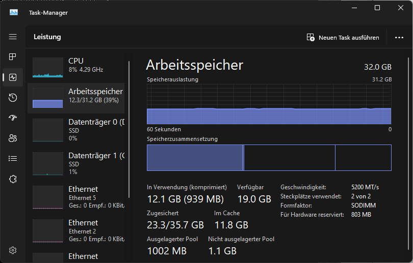
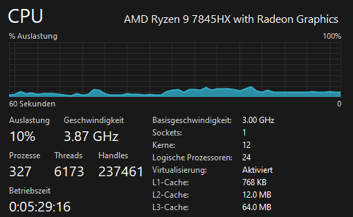
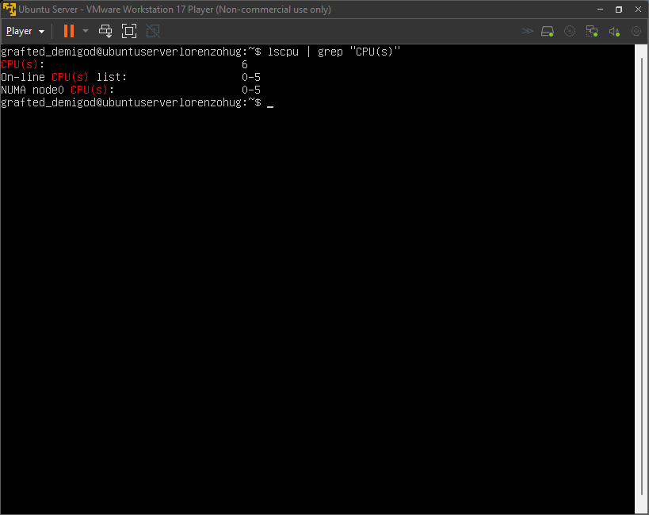
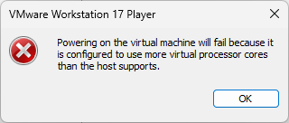
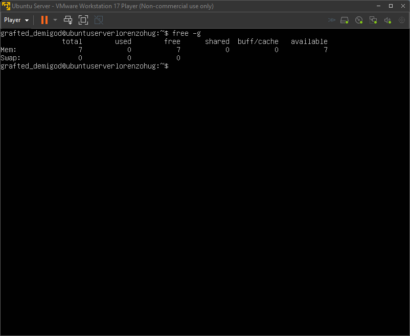
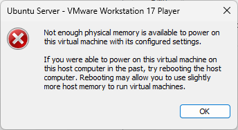

# KN01

> [!IMPORTANT]
> Im untenstehenden Screenshot ist zu sehen, dass mein Host-System über 24 logische Prozessoren und 32 GB Arbeitsspeicher verfügt.

***

Im folgenden Screenshot ist zu erkennen, dass dem Server lediglich 6 CPU-Kerne zugewiesen wurden.

***

Dieser Screenshot zeigt eine Fehlermeldung, die erscheint, nachdem ich versucht habe, dem Server 32 CPU-Kerne zuzuweisen.

***

Im nächsten Screenshot ist ersichtlich, dass dem Server nur 7 GB Arbeitsspeicher zugewiesen wurden.

***

Dieser Screenshot zeigt eine Fehlermeldung, die erscheint, nachdem ich versucht habe, dem Server 64 GB Arbeitsspeicher zuzuweisen.

***

> [!IMPORTANT]
> Es ist grundsätzlich nicht möglich, einer virtuellen Maschine mehr CPU-Kerne oder RAM zuzuweisen, als das Host-System zur Verfügung stellt. Eine virtuelle Maschine kann nur die physischen Ressourcen nutzen, die tatsächlich auf dem Host vorhanden sind. Die Zuweisung dieser Ressourcen wird von Hypervisoren verwaltet, um sicherzustellen, dass die Verteilung der Ressourcen im Rahmen der physisch verfügbaren Kapazitäten bleibt. Obwohl es Techniken wie Overcommitment gibt, bei denen mehr virtuelle Ressourcen zugewiesen werden, als physisch vorhanden sind, kann dies zu erheblichen Leistungseinbussen führen, wenn die VMs tatsächlich versuchen, mehr Ressourcen zu nutzen, als verfügbar sind.
