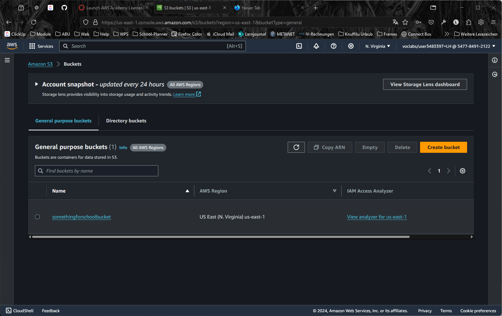
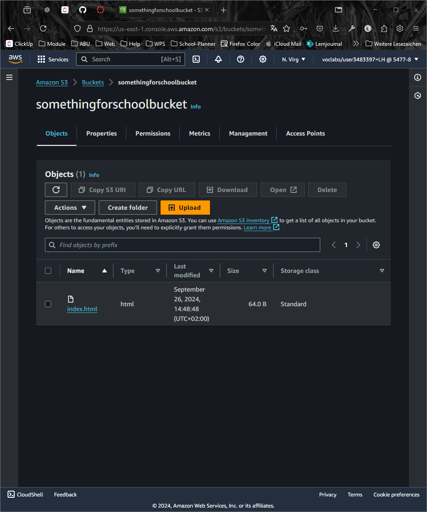
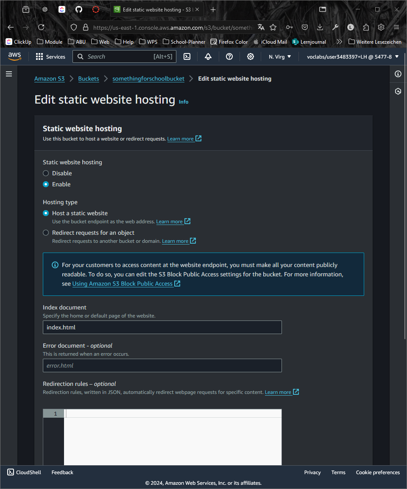
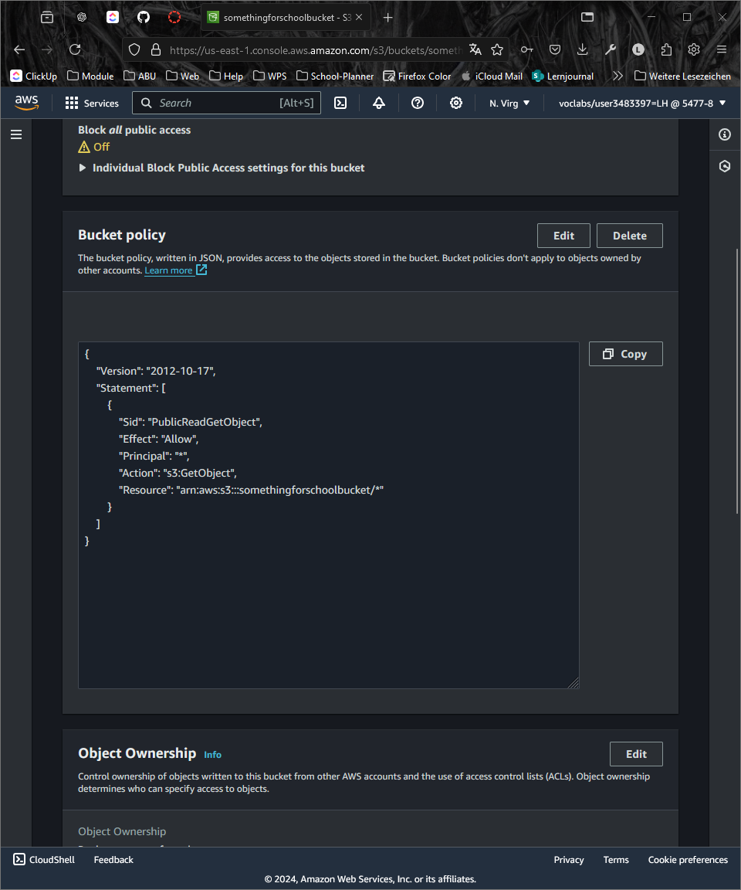
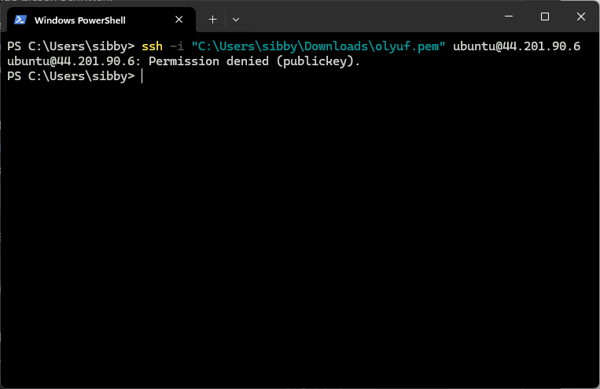
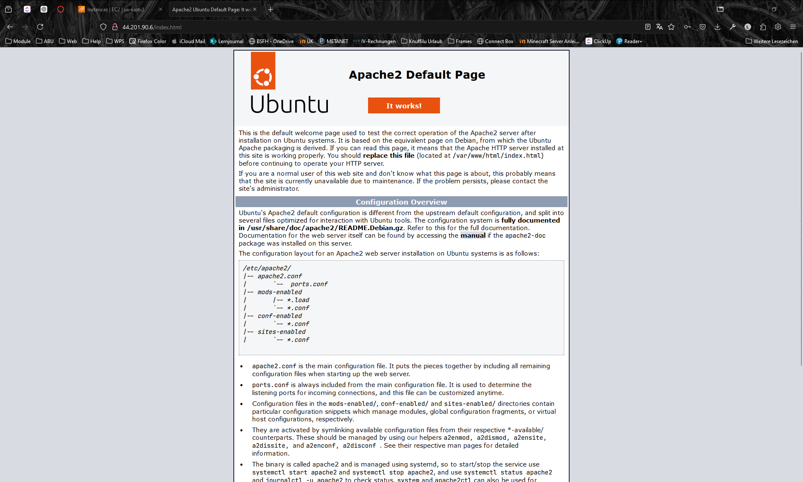
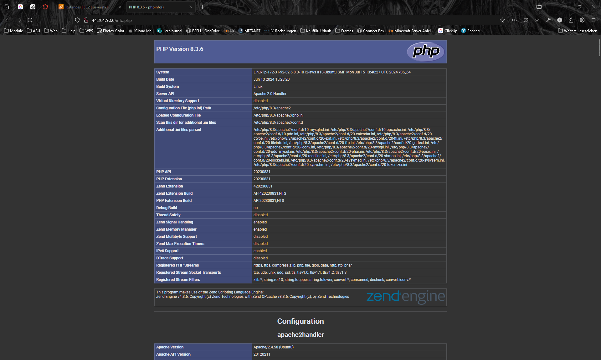
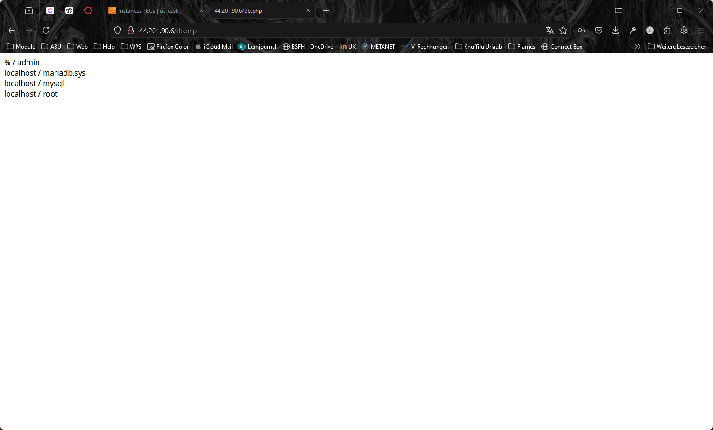

# KN02

## Aufgabe A

### 4.1 - EC2

**HTML-Seite inkl. URL** 

***

**Liste der EC2-Instanzen & Details der Web Server-Instanz(öffentliche IP sichtbar)**

***

**Security-Group: Liste der Inbound-Regeln**

***

### 4.2 - S3

**Liste der Buckets**

***

**HTML Webseite**

***

**Liste der Dateien im Bucket**

***

**Eigenschaften von "Static website hosting"**

***

**JSON-Date**

***

## Aufgabe B

**Versuch mit Private Key**

***

**Versuch mit Public Key**

***

**Liste der Schlüsselpaare**

***

## Aufgabe C

**Apache Webseite**

***

**PHP Info**

***

**DB Info**

***

