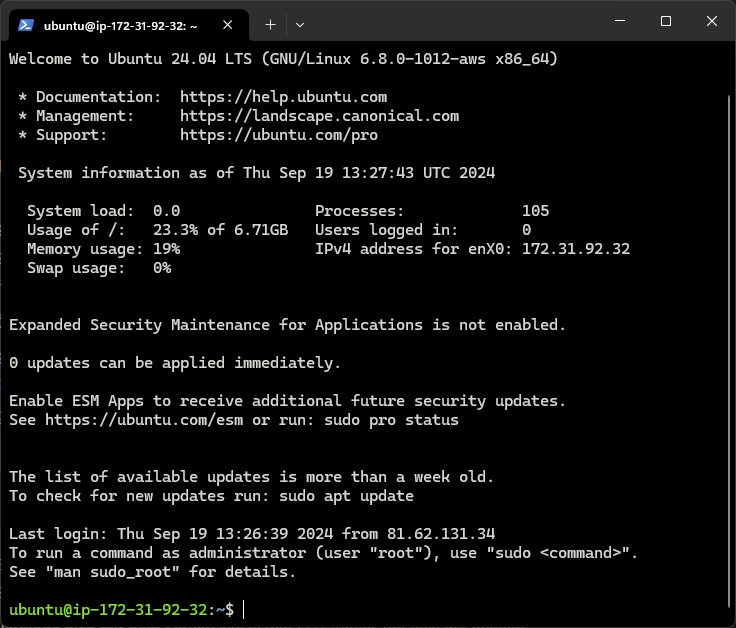

# KN02

## Aufgabe A

### 4.1 - EC2

**HTML-Seite inkl. URL** 
 

**Liste der EC2-Instanzen & Details der Web Server-Instanz(öffentliche IP sichtbar)** 
 

**Security-Group: Liste der Inbound-Regeln** 
 

### 4.2 - S3

**Liste der Buckets** 
 

**HTML Webseite** 
 

**Liste der Dateien im Bucket** 
 

**Eigenschaften von "Static website hosting"** 
 

**JSON-Date** 
 

***

## Aufgabe B

**Versuch mit Private Key** 
 

**Versuch mit Public Key** 
 

**Liste der Schlüsselpaare** 
 

***

## Aufgabe C

**Apache Webseite** 
 

**PHP Info** 
 
 

**DB Info** 
 
 
