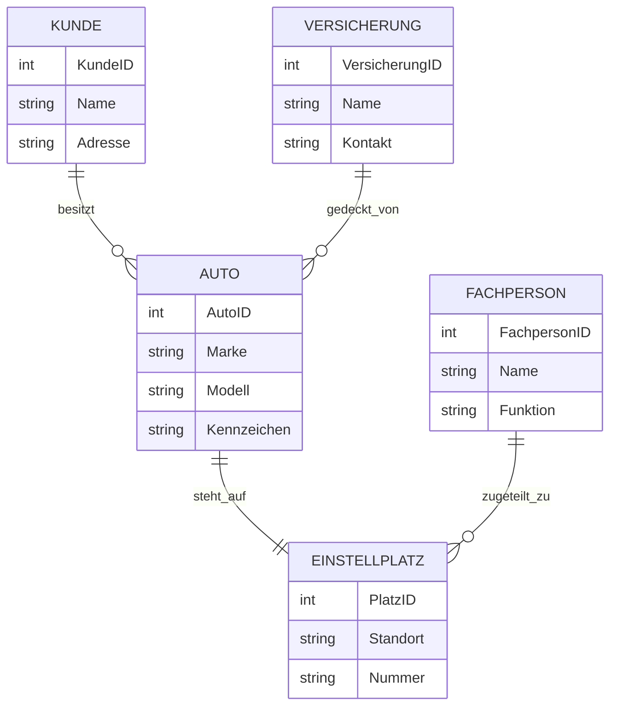
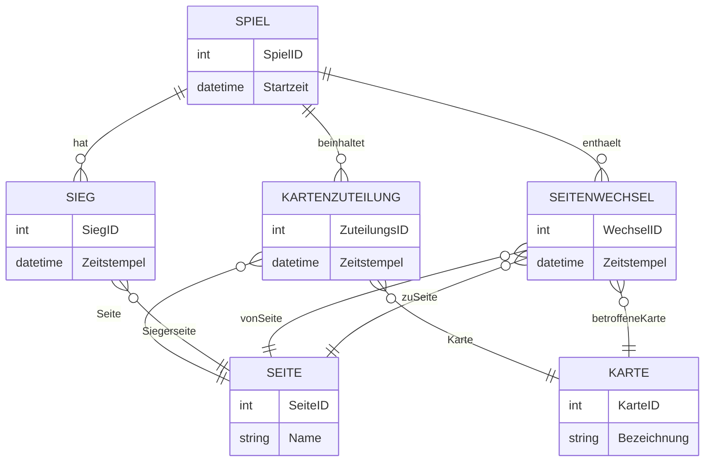

# Garage

```mermaid
erDiagram
KUNDE ||--o{ AUTO : besitzt
VERSICHERUNG ||--o{ AUTO : gedeckt_von
AUTO ||--|| EINSTELLPLATZ : steht_auf
FACHPERSON ||--o{ EINSTELLPLATZ : zugeteilt_zu

    KUNDE {
        int KundeID
        string Name
        string Adresse
    }

    AUTO {
        int AutoID
        string Marke
        string Modell
        string Kennzeichen
    }

    VERSICHERUNG {
        int VersicherungID
        string Name
        string Kontakt
    }

    EINSTELLPLATZ {
        int PlatzID
        string Standort
        string Nummer
    }

    FACHPERSON {
        int FachpersonID
        string Name
        string Funktion
    }
```

# Statistik

```mermaid
erDiagram
    SPIEL ||--o{ KARTENZUTEILUNG : beinhaltet
    SPIEL ||--o{ SIEG : hat
    SPIEL ||--o{ SEITENWECHSEL : enthaelt

    SEITE {
        int SeiteID
        string Name
    }

    KARTE {
        int KarteID
        string Bezeichnung
    }

    SPIEL {
        int SpielID
        datetime Startzeit
    }

    KARTENZUTEILUNG {
        int ZuteilungsID
        datetime Zeitstempel
    }

    SIEG {
        int SiegID
        datetime Zeitstempel
    }

    SEITENWECHSEL {
        int WechselID
        datetime Zeitstempel
    }

    KARTENZUTEILUNG }o--|| SEITE : Seite
    KARTENZUTEILUNG }o--|| KARTE : Karte

    SIEG }o--|| SEITE : Siegerseite

    SEITENWECHSEL }o--|| KARTE : betroffeneKarte
    SEITENWECHSEL }o--|| SEITE : vonSeite
    SEITENWECHSEL }o--|| SEITE : zuSeite
```
