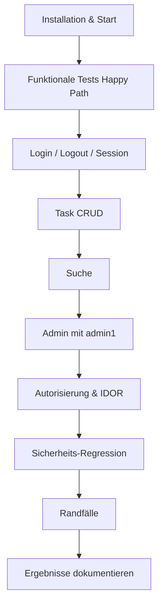

# Testplan – Todo-List App (`todo-list-node`)

**Ziel:** Systematisches Testen der abgesicherten Todo-App vor Übergabe an einen Klassenkameraden.  
**Basis:** Eigene Findings aus dem Code-Review (`Findings.md`) – die dokumentierten Schwachstellen wurden behoben und sollen nun verifiziert werden.  
**Stand:** 2026-06-05

---

## 1. Vorbereitung

### 1.1 App starten

```bash
cd lb2-applikation-main/todo-list-node
npm install
cd ../docker
docker compose -f compose.node.yaml up
```

Die App ist danach unter **[http://localhost](http://localhost)** erreichbar (Port 80 → Container 3000).

> **Hinweis:** Docker Compose ≥ 2.20.3 wird benötigt (`include` in den YAML-Dateien). Falls Port 80 belegt ist, in `compose.node.yaml` anpassen.

### 1.2 Testkonten

| Benutzer | Passwort         | Rolle | Verwendung                         |
| -------- | ---------------- | ----- | ---------------------------------- |
| `admin1` | `Awesome.Pass34` | Admin | Admin-Funktionen, User-Liste       |
| `user1`  | `Amazing.Pass23` | User  | Normale Benutzer-Tests, IDOR-Tests |

Diese Zugangsdaten entsprechen den Standard-Accounts aus dem GitLab-Template (`lb2-applikation`). In der Datenbank sind die Passwörter als bcrypt-Hash gespeichert.

### 1.3 Testumgebung

- Browser: Chrome oder Firefox (DevTools für Netzwerk/Cookies nutzbar)
- Zwei Browser-Profile oder ein normaler + ein Inkognito-Fenster (für parallele Sessions mit `admin1` und `user1`)
- Optional: Browser-Erweiterung zum Bearbeiten von Cookies (z. B. für Session-Manipulation)

### 1.4 Ergebnis dokumentieren

Für jeden Testpunkt notieren:

| Feld        | Inhalt                                       |
| ----------- | -------------------------------------------- |
| Test-ID     | z. B. `AUTH-01`                              |
| Ergebnis    | ✅ bestanden / ❌ fehlgeschlagen / ⚠️ unklar |
| Bemerkung   | Was genau passiert ist, Screenshots optional |
| Schweregrad | Nur bei Fehlern: Niedrig / Mittel / Hoch     |

---

## 2. Funktionale Tests (Happy Path)

Diese Tests prüfen, ob die App grundsätzlich wie erwartet funktioniert.

### 2.1 Login & Logout

| ID      | Schritt                                 | Erwartetes Ergebnis                                                                                       |
| ------- | --------------------------------------- | --------------------------------------------------------------------------------------------------------- |
| FUNC-01 | `/` ohne Login aufrufen                 | Weiterleitung zu `/login`                                                                                 |
| FUNC-02 | Mit `user1` einloggen (POST, nicht GET) | Weiterleitung zu `/`, Begrüssung mit Benutzername                                                         |
| FUNC-03 | Falsches Passwort eingeben              | Fehlermeldung _„Invalid username or password."_ (gleiche Meldung für falschen User und falsches Passwort) |
| FUNC-04 | Leere Felder absenden                   | Fehlermeldung, kein Login                                                                                 |
| FUNC-05 | `/logout` aufrufen                      | Session beendet, Weiterleitung zu `/login`, `/` nicht mehr erreichbar                                     |
| FUNC-06 | Nach Logout erneut `/login` aufrufen    | Login-Formular sichtbar, kein automatischer Re-Login                                                      |

### 2.2 Task-Verwaltung (als `user1`)

| ID      | Schritt                                                | Erwartetes Ergebnis                                |
| ------- | ------------------------------------------------------ | -------------------------------------------------- |
| FUNC-07 | „Create Task" klicken                                  | Formular mit leerem Titel, State-Auswahl           |
| FUNC-08 | Neuen Task erstellen (Titel + State `open`)            | Task erscheint in der Liste                        |
| FUNC-09 | Task bearbeiten (Titel ändern, State auf `done`)       | Änderungen in der Liste sichtbar                   |
| FUNC-10 | Task löschen                                           | Task verschwindet aus der Liste                    |
| FUNC-11 | Alle drei States testen: `open`, `in progress`, `done` | Jeder State wird korrekt gespeichert und angezeigt |

### 2.3 Suche (als `user1`)

| ID      | Schritt                                               | Erwartetes Ergebnis               |
| ------- | ----------------------------------------------------- | --------------------------------- |
| FUNC-12 | Suchbegriff eingeben, der zu einem eigenen Task passt | Treffer werden als Text angezeigt |
| FUNC-13 | Suchbegriff ohne Treffer                              | Meldung _„No results found!"_     |
| FUNC-14 | Leeres Suchfeld absenden                              | Fehlermeldung, kein Absturz       |

### 2.4 Admin-Bereich (als `admin1`)

| ID      | Schritt                 | Erwartetes Ergebnis                                               |
| ------- | ----------------------- | ----------------------------------------------------------------- |
| FUNC-15 | Als `admin1` einloggen  | Navigationslink „User List" sichtbar                              |
| FUNC-16 | `/admin/users` aufrufen | Tabelle mit Benutzern (ID, Username, Rolle), **keine Passwörter** |
| FUNC-17 | Als `user1` einloggen   | Kein Link „User List" in der Navigation                           |

### 2.5 Profil

| ID      | Schritt                                   | Erwartetes Ergebnis                               |
| ------- | ----------------------------------------- | ------------------------------------------------- |
| FUNC-18 | `/profile` als eingeloggter User aufrufen | Begrüssung mit eigenem Benutzernamen, Logout-Link |
| FUNC-19 | `/profile` ohne Login aufrufen            | Weiterleitung zu `/login`                         |

---

## 3. Autorisierung & Zugriffskontrolle

Prüft, ob geschützte Bereiche wirklich geschützt sind (Bezug zu Findings: fehlende Auth, fehlende Admin-Rolle, IDOR).

### 3.1 Ungeschützte Bereiche

| ID      | Schritt                                      | Erwartetes Ergebnis                             |
| ------- | -------------------------------------------- | ----------------------------------------------- |
| AUTH-01 | Ohne Login direkt `/edit` aufrufen           | Weiterleitung zu `/login`                       |
| AUTH-02 | Ohne Login direkt `/admin/users` aufrufen    | Weiterleitung zu `/login`                       |
| AUTH-03 | Ohne Login `/search/v2/?terms=test` aufrufen | Weiterleitung zu `/login` oder _„Unauthorized"_ |
| AUTH-04 | Als `user1` direkt `/admin/users` aufrufen   | HTTP 403 _„Forbidden"_                          |

### 3.2 IDOR – Zugriff auf fremde Tasks

> Zwei Accounts parallel nutzen: `user1` und `admin1` (oder zwei Browser-Profile).

| ID      | Schritt                                                                                | Erwartetes Ergebnis                                                        |
| ------- | -------------------------------------------------------------------------------------- | -------------------------------------------------------------------------- |
| AUTH-05 | Als `user1` Task erstellen, Task-ID notieren                                           | Task nur bei `user1` sichtbar                                              |
| AUTH-06 | Als `admin1` `/edit?id=<ID von user1-Task>` aufrufen                                   | _„Task not found."_ oder Fehlermeldung – **kein** Zugriff auf fremden Task |
| AUTH-07 | Als `user1` per POST `/savetask` versuchen, fremde Task-ID zu ändern (DevTools / curl) | Task von anderem User bleibt unverändert                                   |
| AUTH-08 | Als `user1` per POST `/delete` fremde Task-ID löschen                                  | Task von anderem User bleibt erhalten                                      |
| AUTH-09 | Suche als `user1`                                                                      | Nur eigene Tasks in den Ergebnissen, keine Tasks von `admin1`              |

### 3.3 Session-Manipulation

| ID      | Schritt                                                                          | Erwartetes Ergebnis                                                                   |
| ------- | -------------------------------------------------------------------------------- | ------------------------------------------------------------------------------------- |
| AUTH-10 | Cookie `connect.sid` manuell verändern oder löschen                              | Kein Zugriff auf geschützte Seiten                                                    |
| AUTH-11 | Prüfen, ob alte Cookies `username` / `userid` noch existieren und etwas bewirken | Diese Cookies dürfen **keine** Authentifizierung mehr ermöglichen (nur Session zählt) |

---

## 4. Sicherheitstests (Regression)

Diese Tests prüfen gezielt, ob die in `Findings.md` dokumentierten Schwachstellen behoben wurden.

### 4.1 Injection (SQL, XSS, Script)

| ID     | Test                        | Eingabe / Aktion                        | Erwartetes Ergebnis                                           |
| ------ | --------------------------- | --------------------------------------- | ------------------------------------------------------------- |
| SEC-01 | SQL Injection im Login      | Username: `' OR '1'='1`                 | Login schlägt fehl, keine SQL-Fehlermeldung                   |
| SEC-02 | SQL Injection in Task-Titel | Titel: `'; DROP TABLE tasks; --`        | Task wird als normaler Text gespeichert, DB intakt            |
| SEC-03 | XSS im Task-Titel           | Titel: `<script>alert('XSS')</script>`  | Script wird **nicht** ausgeführt, Text wird escaped angezeigt |
| SEC-04 | XSS im Suchbegriff          | Suche: ``   | Kein Alert, Ausgabe als Text                                  |
| SEC-05 | XSS in Task bearbeiten      | `/edit?id=1"><script>alert(1)</script>` | Kein Script in der Seite, Fehlermeldung oder sichere Ausgabe  |
| SEC-06 | Ungültige Task-ID           | `/edit?id=abc` oder `/edit?id=-1`       | _„Invalid task."_ / _„Task not found."_                       |

### 4.2 Authentifizierung & Session

| ID     | Test                                                         | Erwartetes Ergebnis                                  |
| ------ | ------------------------------------------------------------ | ---------------------------------------------------- |
| SEC-07 | Login-Formular: `method` und URL prüfen (DevTools → Network) | **POST** auf `/login`, Passwort **nicht** in der URL |
| SEC-08 | Passwortfeld im HTML                                         | `type="password"` (Passwort maskiert)                |
| SEC-09 | Session-Cookie `connect.sid` in DevTools prüfen              | `HttpOnly` gesetzt; bei HTTPS auch `Secure`          |
| SEC-10 | 21+ falsche Login-Versuche in 15 Minuten                     | Rate-Limit-Meldung: _„Too many login attempts..."_   |
| SEC-11 | User Enumeration                                             | Falschen Username vs. falsches Passwort              |

### 4.3 CSRF-Schutz

| ID     | Test                                              | Erwartetes Ergebnis              |
| ------ | ------------------------------------------------- | -------------------------------- |
| SEC-12 | Login-, Task- und Delete-Formulare inspizieren    | Hidden-Feld `_csrf` vorhanden    |
| SEC-13 | POST `/savetask` ohne CSRF-Token (z. B. mit curl) | HTTP 403 _„Invalid CSRF token"_  |
| SEC-14 | POST `/delete` ohne CSRF-Token                    | HTTP 403                         |
| SEC-15 | POST `/login` ohne CSRF-Token                     | HTTP 403                         |
| SEC-16 | Delete-Aktion                                     | Per **POST**, nicht per GET-Link |

### 4.4 Suche & SSRF

| ID     | Test                                                                 | Erwartetes Ergebnis                                                     |
| ------ | -------------------------------------------------------------------- | ----------------------------------------------------------------------- |
| SEC-17 | Suchformular: kein manipulierbares `provider`- oder `searchurl`-Feld | Nur `terms` (+ CSRF) wird gesendet                                      |
| SEC-18 | `/search/v2/` direkt mit fremder `userid` aufrufen                   | Kein Zugriff auf fremde Daten (Session-basiert)                         |
| SEC-19 | 31+ Suchanfragen in einer Minute                                     | Rate-Limit-Meldung                                                      |
| SEC-20 | Suchergebnis im DOM                                                  | Ergebnis wird als Text eingefügt (`.text()`), kein ausführbares HTML/JS |

### 4.5 Admin & sensible Daten

| ID     | Test                                                              | Erwartetes Ergebnis                           |
| ------ | ----------------------------------------------------------------- | --------------------------------------------- |
| SEC-21 | `/admin/users` Seitenquelltext prüfen                             | **Keine** Passwort-Felder oder Hashes im HTML |
| SEC-22 | XSS in Admin-Tabelle (falls Testuser mit Sonderzeichen existiert) | Username/Rolle escaped, kein Script           |
| SEC-23 | User-Liste nach neuem Login                                       | Aktuelle Daten (nicht veralteter Cache)       |

### 4.6 Security-Header & Konfiguration

| ID     | Test                                                          | Erwartetes Ergebnis                                                 |
| ------ | ------------------------------------------------------------- | ------------------------------------------------------------------- |
| SEC-24 | Response-Header prüfen (DevTools → Network → beliebige Seite) | u. a. `Content-Security-Policy`, `X-Content-Type-Options` vorhanden |
| SEC-25 | jQuery von CDN                                                | Script-Tag mit `integrity`-Attribut (SRI)                           |
| SEC-26 | `.env.example` / Konfiguration                                | Keine echten Secrets im Quellcode committet (nur Platzhalter)       |

---

## 5. Randfälle & Stabilität

| ID      | Schritt                                                  | Erwartetes Ergebnis                                                    |
| ------- | -------------------------------------------------------- | ---------------------------------------------------------------------- |
| EDGE-01 | Sehr langer Task-Titel (z. B. 500 Zeichen)               | Sinnvolles Verhalten (Speichern oder Validierungsfehler), kein Absturz |
| EDGE-02 | Sonderzeichen im Titel: `äöü`, `"`, `'`, `&`, `<`, `>`   | Korrekt gespeichert und angezeigt                                      |
| EDGE-03 | Doppelklick auf „Submit" beim Task-Speichern             | Kein doppelter Task oder klar nachvollziehbares Verhalten              |
| EDGE-04 | Zurück-Button nach Logout und Formular absenden          | Kein unbeabsichtigter Zugriff auf geschützte Aktionen                  |
| EDGE-05 | Ungültiger `state`-Wert per POST manipulieren (DevTools) | Task wird nicht mit ungültigem State gespeichert                       |
| EDGE-06 | App nach Docker-Neustart                                 | Login und Tasks funktionieren weiterhin                                |

---

## 6. Empfohlene Testreihenfolge



**Zeitaufwand (Richtwert):** ca. 2–3 Stunden für den vollständigen Plan.

---

## 7. Prioritäten bei knapper Zeit

Wenn nicht alles getestet werden kann, mindestens diese Punkte abarbeiten:

1. **FUNC-01 bis FUNC-11** – Grundfunktionen
2. **AUTH-04 bis AUTH-09** – Admin-Schutz und IDOR
3. **SEC-03, SEC-07, SEC-12, SEC-13** – XSS, Login per POST, CSRF
4. **SEC-10, SEC-21** – Rate-Limiting und keine Passwort-Leaks im Admin

---

## 8. Fehler melden

Bei gefundenen Problemen dem Entwickler folgende Infos geben:

1. **Test-ID** aus diesem Plan
2. **Schritte** zur Reproduktion (nummeriert)
3. **Erwartetes** vs. **tatsächliches** Verhalten
4. **Browser** und ggf. verwendeter Account
5. **Screenshot** oder Ausschnitt aus DevTools (Network / Cookies / Response)

---

## 9. Bezug zu den ursprünglichen Findings

Dieser Testplan deckt die wichtigsten Kategorien aus `Findings.md` ab:

| Kategorie (Findings)              | Testbereich in diesem Plan |
| --------------------------------- | -------------------------- |
| Session / Cookie-Auth             | Abschnitt 3.3, 4.2         |
| SQL Injection                     | SEC-01, SEC-02             |
| XSS (reflected / stored / DOM)    | SEC-03 bis SEC-05, SEC-20  |
| IDOR                              | AUTH-05 bis AUTH-09        |
| Fehlende Admin-Prüfung            | AUTH-04, FUNC-17           |
| CSRF                              | SEC-12 bis SEC-16          |
| SSRF / manipulierbarer Provider   | SEC-17, SEC-18             |
| Passwort-Leaks / User Enumeration | SEC-11, SEC-21             |
| Rate-Limiting                     | SEC-10, SEC-19             |
| Security-Header / SRI             | SEC-24, SEC-25             |

Ein bestandener Test bedeutet: Die entsprechende Schwachstelle ist für diesen Angriffsvektor **nicht mehr ausnutzbar**.
