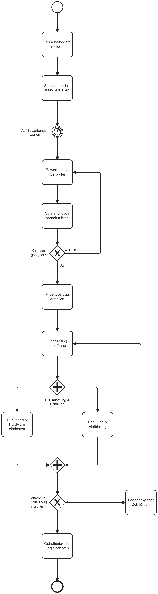

# Personalverwaltung

## Einleitung

Dieses BPMN-Diagramm zeigt den Prozess der Einstellung eines neuen Mitarbeiters. Es dient als visuelle Darstellung der einzelnen Schritte und Entscheidungen, die während des Einstellungsprozesses getroffen werden müssen.

## Zielsetzung

Der Prozess soll Mitarbeitern helfen, die Schritte des Einstellungsprozesses besser zu verstehen und sicherzustellen, dass alle notwendigen Aufgaben effizient und korrekt ausgeführt werden.

## Kurze textliche Beschreibung des Prozesses

1. **Personalbedarf melden**: Der Bedarf an neuem Personal wird gemeldet.
2. **Stellenausschreibung erstellen**: Eine Stellenausschreibung wird erstellt und veröffentlicht.
3. **Bewerbungen überprüfen**: Eingehende Bewerbungen werden überprüft.
4. **Vorstellungsgespräch führen**: Geeignete Kandidaten werden zu Vorstellungsgesprächen eingeladen.
5. **Kandidat geeignet?**: Es wird entschieden, ob der Kandidat geeignet ist.
    - **Ja**: Ein Arbeitsvertrag wird erstellt.
    - **Nein**: Der Prozess kehrt zur Überprüfung der Bewerbungen zurück.
6. **Arbeitsvertrag erstellen**: Ein Arbeitsvertrag wird für den ausgewählten Kandidaten erstellt.
7. **Onboarding durchführen**: Der neue Mitarbeiter wird in das Unternehmen eingeführt.
8. **IT Einrichtung & Schulung**: IT-Zugang und Hardware werden eingerichtet, und Schulungen werden durchgeführt.
9. **Mitarbeiter vollständig integriert?**: Es wird überprüft, ob der Mitarbeiter vollständig integriert ist.
    - **Ja**: Der Prozess endet.
    - **Nein**: Ein Feedbackgespräch wird geführt und der Onboarding-Prozess wird fortgesetzt.

## Fachbegriffe im Prozess

-   **Personalbedarf**: Der Bedarf an zusätzlichem Personal in einer Abteilung oder einem Team.
-   **Stellenausschreibung**: Eine öffentliche Bekanntmachung einer offenen Position im Unternehmen.
-   **Vorstellungsgespräch**: Ein Gespräch zwischen dem Arbeitgeber und dem Bewerber, um die Eignung des Bewerbers zu beurteilen.
-   **Onboarding**: Der Prozess der Einführung und Integration eines neuen Mitarbeiters in das Unternehmen.
-   **IT-Zugang**: Die Bereitstellung von Zugangsdaten und Hardware für den neuen Mitarbeiter.
-   **Feedbackgespräch**: Ein Gespräch, in dem der Fortschritt und die Integration des neuen Mitarbeiters besprochen werden.

## Diagramm

Das BPMN-Diagramm für diesen Prozess kann in der Datei [`lb.bpmn`](./lb.bpmn) gefunden werden.

