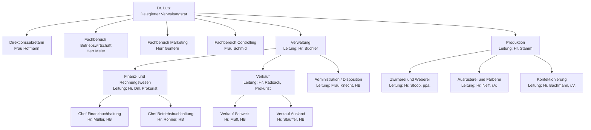

# Projekt Organisation

## Aufgabe 1

**Organigramm**

---

## Aufgabe 2

Eine Stabstelle ist eine organisatorische Einheit innerhalb eines Unternehmens oder einer Organisation, die beratende, unterstützende oder kontrollierende Aufgaben übernimmt, aber keine direkte Weisungsbefugnis gegenüber den ausführenden Stellen hat.

Stabstellen dienen dazu, die Leitung oder andere Abteilungen fachlich zu unterstützen, z. B. durch Analysen, Planungen oder Empfehlungen. Typische Beispiele sind die Rechtsabteilung, die Controlling-Abteilung oder die Unternehmensplanung.

Merkmale einer Stabstelle:

Keine direkte Weisungsbefugnis (also keine Entscheidungsbefugnis über andere Abteilungen)

Beratung und Unterstützung der Linieninstanzen

Fachliche Expertise in einem bestimmten Bereich

---

## Aufgabe 3

Die **Kontrollspanne** (oder **Spanne der Kontrolle**) ist ein betriebswirtschaftlicher Begriff aus der **Organisationslehre**. Sie gibt an, **wie viele Mitarbeiter direkt von einer Führungskraft geführt werden können oder sollen**.

Kurz gesagt: Sie zeigt **die Anzahl der Untergebenen, die ein Vorgesetzter effektiv beaufsichtigen kann**.

**Ein paar wichtige Punkte:**

1. **Eng vs. weit**
    - **Enge Kontrollspanne:** Wenige Mitarbeiter pro Vorgesetztem → mehr Hierarchieebenen, z. B. in komplexen oder stark spezialisierten Bereichen.
    - **Weite Kontrollspanne:** Viele Mitarbeiter pro Vorgesetztem → flachere Hierarchie, z. B. in standardisierten oder Routineprozessen.

2. **Abhängigkeiten**
    - Je komplexer die Aufgaben, desto **enger** sollte die Kontrollspanne sein.
    - Routineaufgaben können eine **weitere** Kontrollspanne erlauben.

3. **Visualisierung**
   In einem Organigramm siehst du die Kontrollspanne oft **an der Anzahl der Linien, die von einem Vorgesetzten zu seinen Mitarbeitern führen**.

**Beispiel aus deinem Organigramm KS Textil AG:**

- Hr. Büchler leitet die Verwaltung mit drei Abteilungen → **Kontrollspanne = 3 Abteilungsleiter**
- Hr. Dill leitet das Finanz- und Rechnungswesen mit zwei Chefs → **Kontrollspanne = 2**

---

## Aufgabe 4

Aus einer **Organisationsstruktur** lassen sich neben der Kontrollspanne noch viele andere Informationen über ein Unternehmen ableiten. Zwei wichtige Beispiele sind:

1. **Hierarchieebenen / Leitungslinien**
    - Man sieht, **wer wem unterstellt ist** und wie die Entscheidungswege verlaufen.
    - Beispiel: In deinem KS Textil AG Organigramm ist klar, dass **Hr. Büchler** der Verwaltung unterstellt ist und die **Abteilungsleiter** ihm direkt berichten.

2. **Aufgaben- und Zuständigkeitsbereiche**
    - Man erkennt, **welche Abteilungen für welche Funktionen verantwortlich sind**.
    - Beispiel: Die **Abteilung Verkauf** ist zuständig für **Inland und Ausland**, die **Produktion** für die Herstellung der Hemden.

Optional könnten noch **Kommunikationswege, Anzahl Mitarbeiter pro Bereich oder Spezialisierung der Abteilungen** aus der Struktur abgeleitet werden.

---

## Aufgabe 5

Die **kleinste organisatorische Einheit** einer Unternehmung nennt man **Stelle**.

- Eine **Stelle** ist eine **Position**, die von einer Person besetzt wird und **konkrete Aufgaben, Kompetenzen und Verantwortungen** hat.
- Mehrere Stellen können zu **Abteilungen** oder **Teams** zusammengefasst werden.

Beispiel: In deinem KS Textil AG Organigramm ist **Hr. Müller, Chef Finanzbuchhaltung** eine Stelle.
g