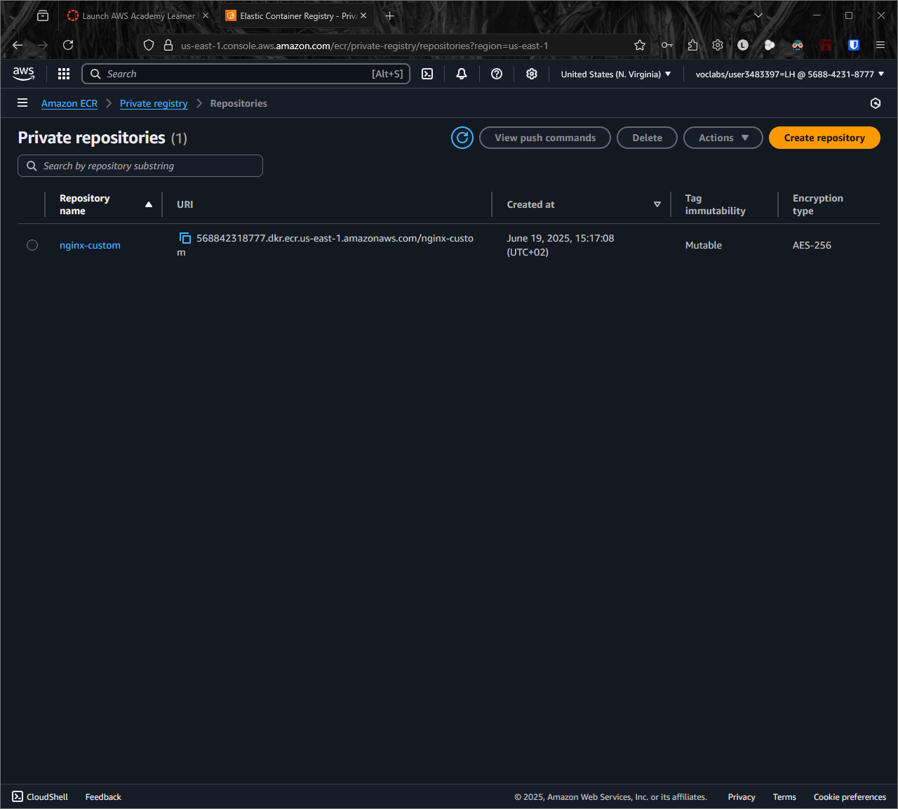
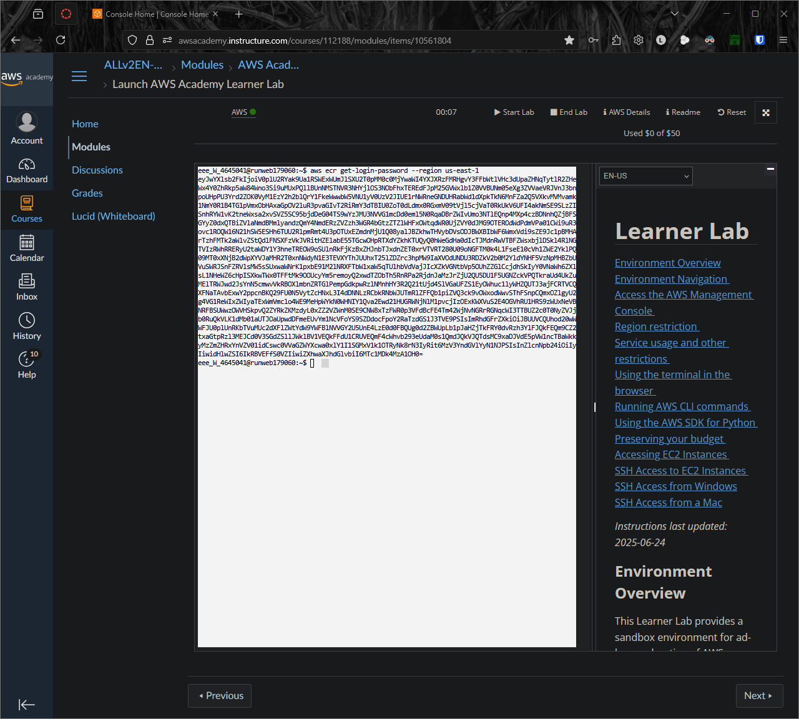
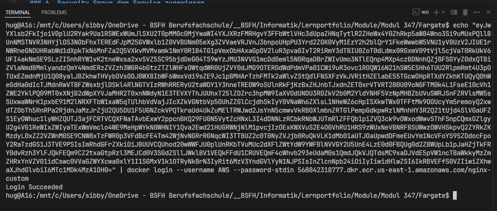
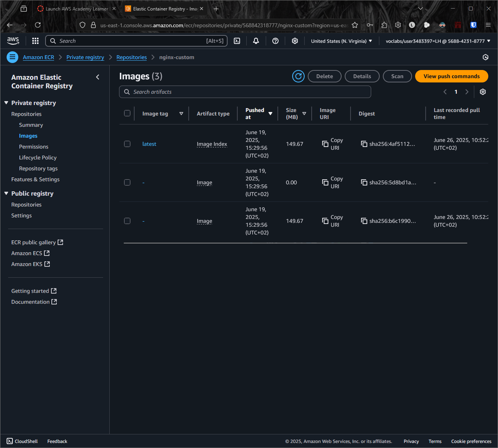
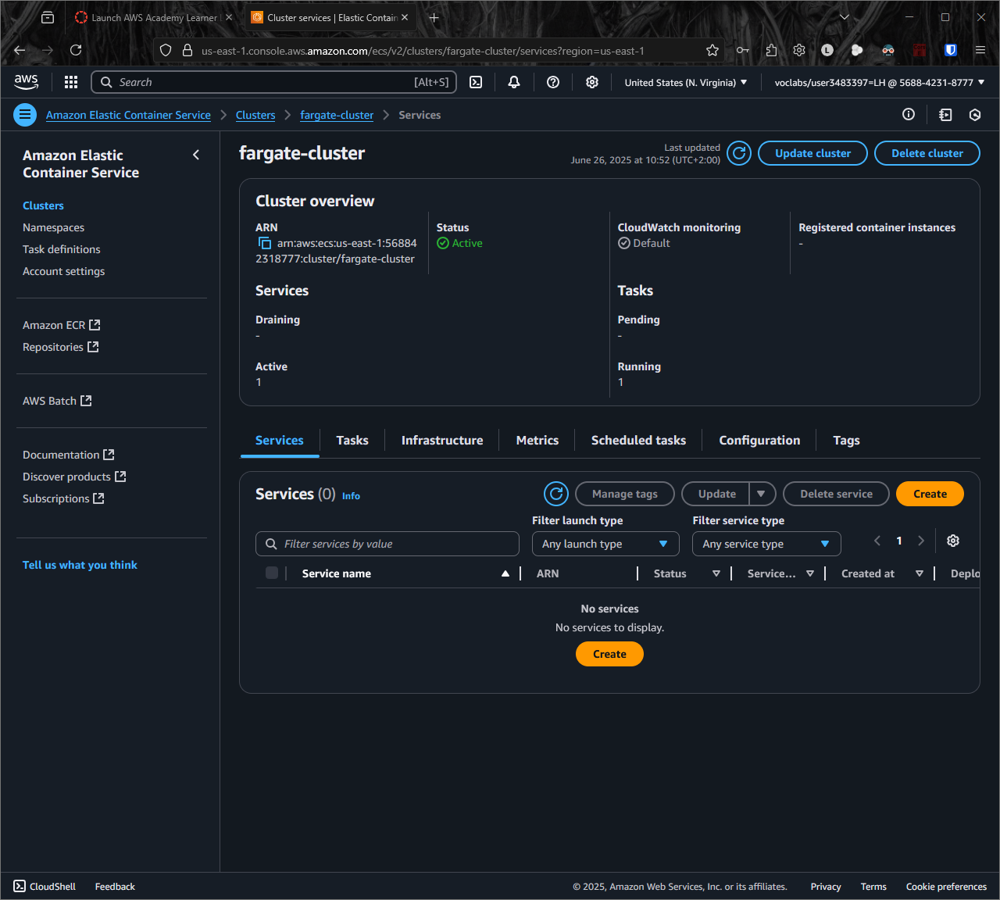
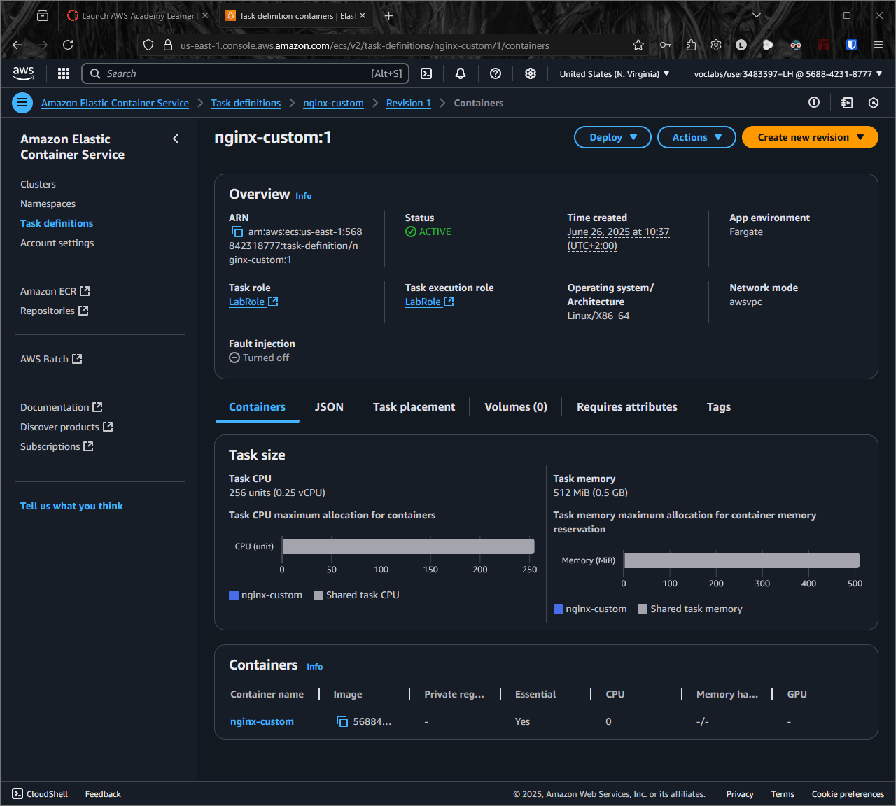
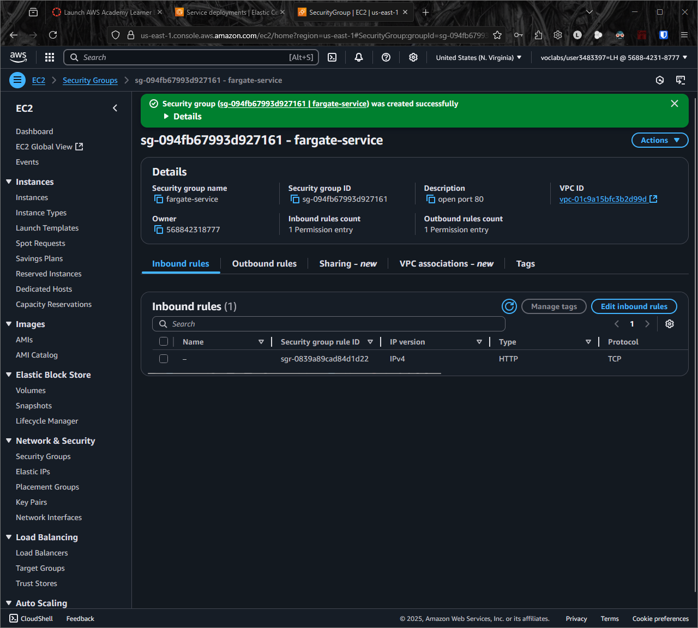
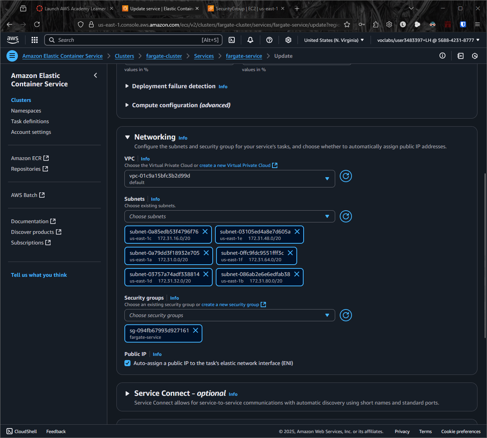
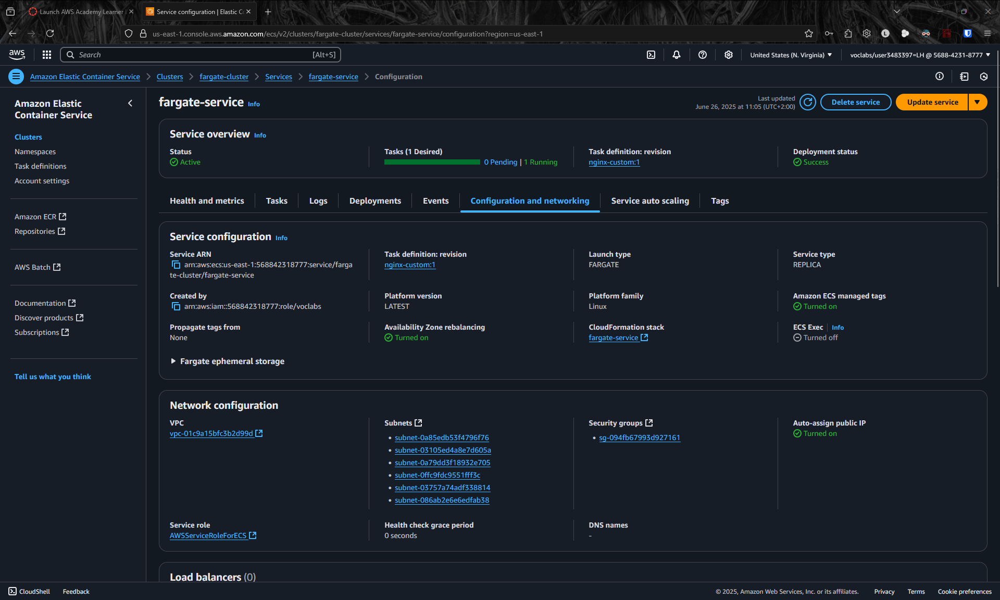
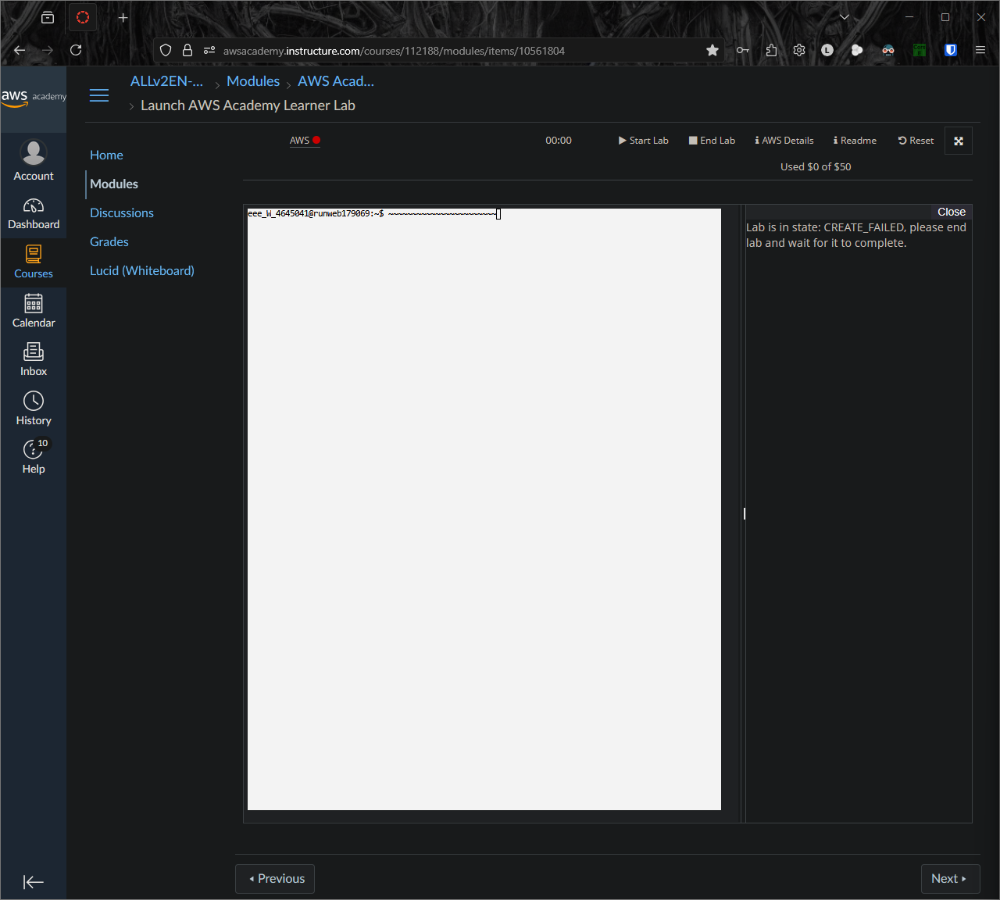

# AWS Fargate Container Deployment - Schritt-für-Schritt Anleitung

Diese Dokumentation beschreibt den vollständigen Prozess der Bereitstellung eines Containers mit AWS Fargate, von der Repository-Erstellung bis zur Fehlerbehebung.

## 1. Repository erstellen

**Beschreibung:** Das erste Bild zeigt die erfolgreiche Erstellung eines Git-Repositories. Dies ist der Ausgangspunkt für unser Container-Projekt.

**Was passiert:** Ein neues Repository wird erstellt, um den Quellcode für die Container-Anwendung zu verwalten.

**Warum wichtig:** Das Repository ermöglicht die Versionskontrolle und Zusammenarbeit am Projekt.

## 2. Token erhalten

**Beschreibung:** Hier wird ein persönliches Zugriffstoken (Personal Access Token) für die Authentifizierung erstellt.

**Was passiert:** Ein sicherer Token wird generiert, der für die Authentifizierung bei Git-Operationen verwendet wird.

**Warum wichtig:** Der Token ermöglicht sichere Authentifizierung ohne Verwendung von Passwörtern.

## 3. Login funktioniert

**Beschreibung:** Die Authentifizierung mit dem erstellten Token war erfolgreich.

**Was passiert:** Das System bestätigt, dass die Anmeldung mit dem Personal Access Token funktioniert.

**Warum wichtig:** Bestätigt, dass die Authentifizierung korrekt konfiguriert ist.

## 4. Image erstellt

**Beschreibung:** Das Docker-Image wurde erfolgreich erstellt und ist bereit für die Bereitstellung.

**Was passiert:** Ein Container-Image wird aus dem Dockerfile und dem Quellcode erstellt.

**Warum wichtig:** Das Image enthält die Anwendung und alle Abhängigkeiten für die Ausführung.

## 5. Cluster

**Beschreibung:** Ein Amazon ECS (Elastic Container Service) Cluster wurde erstellt.

**Was passiert:** Ein logischer Gruppierungsmechanismus für Container-Aufgaben wird eingerichtet.

**Warum wichtig:** Der Cluster organisiert und verwaltet die Container-Ausführung.

## 6. Container

**Beschreibung:** Detaillierte Ansicht der Container-Konfiguration und des Status.

**Was passiert:** Der Container wird konfiguriert und bereitgestellt.

**Warum wichtig:** Zeigt den aktuellen Status und die Konfiguration des laufenden Containers.

## 7. Security Group erstellt

**Beschreibung:** Eine AWS Security Group wurde erstellt, um den Netzwerkzugriff zu kontrollieren.

**Was passiert:** Firewall-Regeln werden definiert, um eingehenden und ausgehenden Verkehr zu kontrollieren.

**Warum wichtig:** Sicherheit durch kontrollierten Netzwerkzugriff.

## 8. Security Group dem Service zugewiesen

**Beschreibung:** Die erstellte Security Group wurde dem Fargate-Service zugewiesen.

**Was passiert:** Die Firewall-Regeln werden auf den Container-Service angewendet.

**Warum wichtig:** Der Container ist jetzt durch die definierten Sicherheitsregeln geschützt.

## 9. Keine IP-Adresse gefunden

**Beschreibung:** Ein Problem beim Abrufen der öffentlichen IP-Adresse des Containers.

**Was passiert:** Das System kann die IP-Adresse nicht finden oder anzeigen.

**Warum wichtig:** Ohne IP-Adresse ist der Container nicht von außen erreichbar.

## 10. Lab Error

**Beschreibung:** Ein Fehler ist im Lab-System aufgetreten.

**Was passiert:** Das AWS Lab-System meldet einen Fehler bei der Ausführung.

**Warum wichtig:** Zeigt, dass es Probleme mit der Konfiguration oder dem System gibt.
