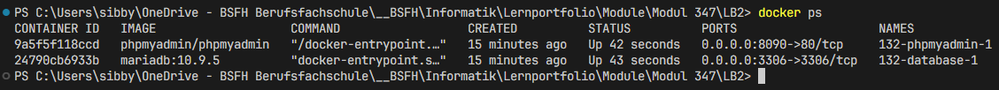
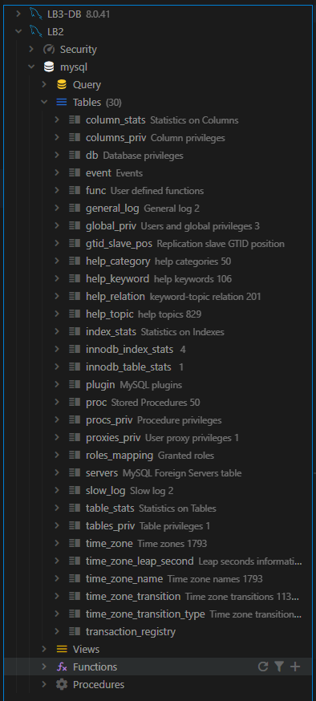
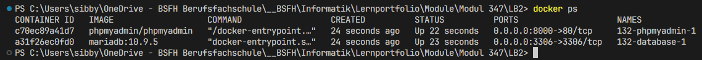

### Aufgabe 1: Fragen zu Docker-Compose

```yml
version: "3"

services:
    phpmyadmin:
        image: phpmyadmin/phpmyadmin # Image 1
        depends_on:
            - database # Wird nach database gestartet
        ports:
            - "8090:80" # Port 1
        environment:
            PMA_HOST: database
    database:
        image: mariadb:10.9.5 # Image 2
        ports:
            - "3306:3306" # Port 2
        volumes:
            - ./db_data:/var/lib/mysql # Ordner Name
        restart: always
        environment:
            MYSQL_ROOT_PASSWORD: 123456
```

### Aufgabe 2: Docker-Compose erweiteren

```yml
version: "3"

services:
    phpmyadmin:
        image: phpmyadmin/phpmyadmin
        depends_on:
            - database
        ports:
            - "8090:80"
        environment:
            PMA_HOST: database
    database:
        image: mariadb:10.9.5
        ports:
            - "3306:3306"
        volumes:
            - ./db_data:/var/lib/mysql
        restart: always
        environment:
            MYSQL_ROOT_PASSWORD: 123456
    mybackend:
        image: MyBackend:1.0
        ports:
            - "8080:8080"
```

### Aufgabe 1: Docker-Compose analyieren

Logs:



Datenbank Zugriff mit VSCode:



### Aufgabe 2: Analysieren, geänderter Port phpmyadmin

Container nach Änderung des Ports von PhpMyAdmin von 8090 auf 8080:



### Aufgabe 3: Analysieren, geänderter Port DB

Von aussen kann man nur über den extern freigegebenen
Port (3306) auf die Datenbank zugreifen und der Zugriff
schlägt fehl, wenn man fälschlicherweise den internen
Port (3307) verwendet, der nur innerhalb des
Docker-Netzwerks gilt.
