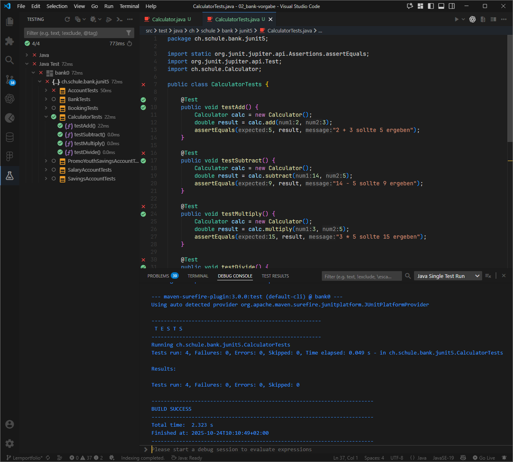
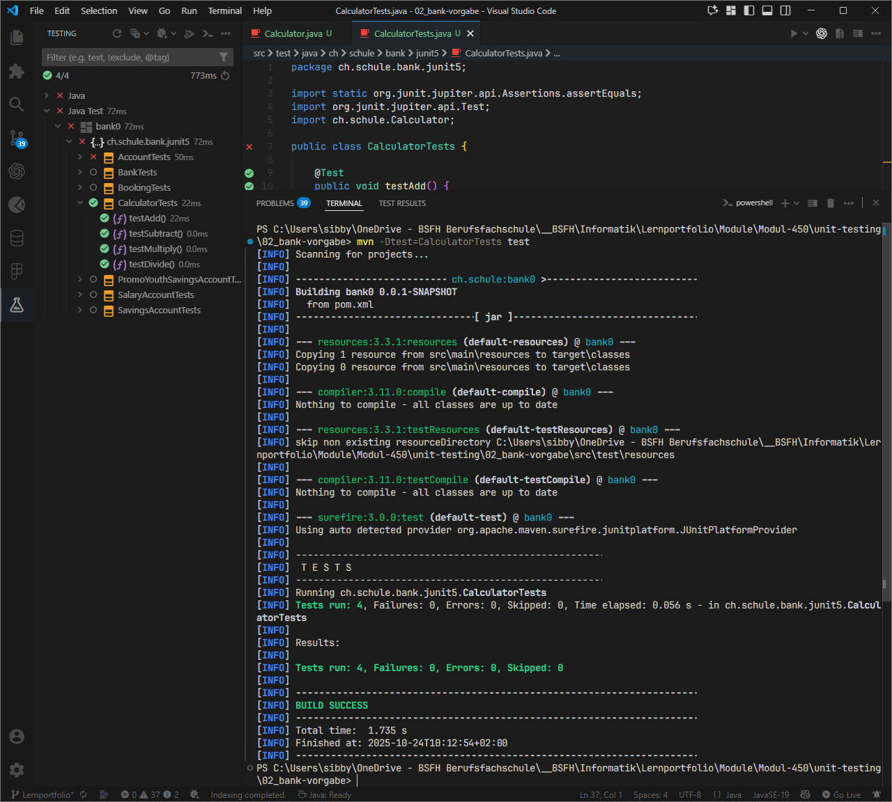

# Unit Testing

## Aufgabe 1 - Simpler Rechner

[**Calculator Klasse**](./02_bank-vorgabe/src/main/java/ch/schule/Calculator.java)

```java
package ch.schule;

public class Calculator {

    public double add(double num1, double num2) {
        return num1 + num2;
    }

    public double subtract(double num1, double num2) {
        return num1 - num2;
    }

    public double multiply(double num1, double num2) {
        return num1 * num2;
    }

    public double divide(double num1, double num2) {
        return num1 / num2;
    }
}
```

[**Calculator Test Klasse**](./02_bank-vorgabe/src/test/java/ch/schule/bank/junit5/CalculatorTests.java)

```java
package ch.schule.bank.junit5;

import static org.junit.jupiter.api.Assertions.assertEquals;
import org.junit.jupiter.api.Test;
import ch.schule.Calculator;

public class CalculatorTests {

    @Test
    public void testAdd() {
        Calculator calc = new Calculator();
        double result = calc.add(2, 3);
        assertEquals(5, result, "2 + 3 sollte 5 ergeben");
    }

    @Test
    public void testSubtract() {
        Calculator calc = new Calculator();
        double result = calc.subtract(14, 5);
        assertEquals(9, result, "14 - 5 sollte 9 ergeben");
    }

    @Test
    public void testMultiply() {
        Calculator calc = new Calculator();
        double result = calc.multiply(3, 5);
        assertEquals(15, result, "3 * 5 sollte 15 ergeben");
    }

    @Test
    public void testDivide() {
        Calculator calc = new Calculator();
        double result = calc.divide(20, 4);
        assertEquals(5, result, "20 / 4 sollte 5 ergeben");
    }
}
```

**Ausführung der Tests mit Visual Studio Code**



**Ausführung der Tests im Terminal**



---

## Aufgabe 2 - JUnit Zusammenfassung

JUnit ist ein weit verbreitetes Testframework für Java, das Entwicklern hilft, automatisierte Unit-Tests zu schreiben und auszuführen. Es unterstützt Testautomatisierung, Testorganisation und Ergebnisüberprüfung auf einfache Weise.

### 1. `@Test`

Markiert eine Methode als Test.

```java
@Test
void testAdd() {
    assertEquals(5, new Calculator().add(2,3));
}
```

### 2. Assertions

Überprüfen Ergebnisse:

- `assertEquals(expected, actual)`
- `assertTrue(condition)`
- `assertThrows(Exception.class, () -> {...})`

### 3. Setup & Teardown

- `@BeforeEach` / `@AfterEach` → vor/nach jedem Test
- `@BeforeAll` / `@AfterAll` → einmal pro Klasse

### 4. `@DisplayName`

Lesbarer Testname:

```java
@DisplayName("Addition zweier Zahlen")
```

### 5. Parameterized Tests

Mehrere Eingaben testen:

```java
@ParameterizedTest
@ValueSource(ints = {1,2,3})
void testNumbers(int n) { assertTrue(n>0); }
```

### 6. `@Nested`

Tests logisch gruppieren:

```java
@Nested class WhenNew { ... }
```

### 7. `@Disabled`

Test vorübergehend deaktivieren.

### 8. Tags

Tests gruppieren und selektiv ausführen:

```java
@Tag("integration")
```

### Referenz

[JUnit 5 User Guide](https://junit.org/junit5/docs/current/user-guide/)

---

## Aufgabe 3 - Banken Simulation

**Kernklassen:**

- **Bank:** Hauptklasse, die die Konten verwaltet
- **Account:** Abstrakte Basisklasse für alle Kontotypen
- **SavingsAccount:** Normales Sparkonto
- **SalaryAccount:** Gehaltskonto mit Kreditrahmen
- **PromoYouthSavingsAccount:** Spezielles Jugendkonto mit 1% Bonus auf Einzahlungen

**Hauptfunktionen:**

- Kontoerstellung für verschiedene Typen
- Ein- und Auszahlungen mit Datumsverfolgung
- Kontostandabfrage und Kontoauszüge
- Transaktionshistorie über die Klasse **Booking**
- Konten nach Kontostand sortieren (Top/Bottom 5)

**Kontoverwaltung:**

- Jedes Konto hat eine eindeutige ID (Format: Typ-Nummer)
- Konten werden in einer **TreeMap** in der Klasse **Bank** gespeichert

**Kontotypen:**

- **S-xxxx:** Sparkonten
- **Y-xxxx:** Jugendkonten
- **P-xxxx:** Gehaltskonten

**Besondere Funktionen:**

- Datumsverwaltung in Bankarbeitstagen seit 1970
- Betragsverwaltung in „Millirappen“ (1/1000 eines Rappen)
- Transaktionsvalidierung mit Datum
- Monatliche Kontoauszugserstellung
- Vergleichsfunktion für Konten

**Tests:**

- JUnit 5 Testframework
- Separate Testklassen für jede Komponente
- Derzeit viele Tests als „toDo“ markiert

Die Architektur folgt den Prinzipien der objektorientierten Programmierung mit **Vererbung** und **Kapselung**, um verschiedene Kontotypen und Funktionalitäten abzubilden.
