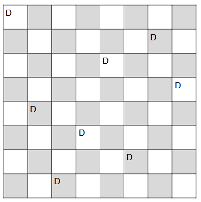

# Lernjournal

## 2026-06-19

### Funktionales Sortieren (LB2 – Fortsetzung)

Vertiefung der LB2-Aufgabe aus dem Projekt `lb2`: Sortierung von `Hunter`-Objekten aus einer CSV-Datei mit verschiedenen Comparator-Varianten und mehrstufigen Sortierkriterien (z. B. `Transformed → Insight → Name`, Sortierung nach Waffen-Attributen).

---

## 2026-06-12

### Funktionales Sortieren (LB2)

Im Projekt `lb2` wurden `Hunter` und `HunterInsightComparator` implementiert. In `Main.java` werden verschiedene Sortierformen ausprobiert:

- **Comparable** – Natural Order über `compareTo()` in `Hunter` (nach Name)
- **Comparator-Klasse** – eigene Klasse `HunterInsightComparator`
- **Anonyme Klasse** – Sortierung nach `HuntStart`
- **Lambda Expression** – Sortierung nach `isTransformed`
- **Comparator Chain** – mehrere Kriterien verkettet mit `thenComparing`

Zusätzlich: `Comparator.naturalOrder()`, `reverseOrder()` und mehrstufige Sortierung über Waffen-Attribute (`Weapon`).

---

## 2026-06-05

### Funktionales Sortieren (LB2 – Einstieg)

Start der LB2-Aufgabe `16.2_AufgabeFunktionalSortieren`: Datenmodell mit `Weapon`-Klasse und `hunters.csv` angelegt. Die CSV enthält Hunter-Daten (Name, Insight, Transformed, HuntStart, Waffen-Attribute), die später sortiert werden.

---

## 2026-05-29

**Lombok** ist eine Java-Bibliothek, die beim Kompilieren aus Annotationen automatisch Standard-Code erzeugt — damit du Getter, Setter, Konstruktoren usw. nicht selbst schreiben musst.

In deinem Projekt steht Lombok in der `pom.xml` als `provided`-Abhängigkeit: Es wird nur zum Kompilieren gebraucht; der erzeugte Code landet in den `.class`-Dateien.

## Was `@Value` in deiner `Customer`-Klasse macht

```6:12:lb2vorbereitung/src/main/java/lb2vorbereitung/Customer.java
@Value
public class Customer {
    private String firstName;
    private String lastName;
    private Date birthdate;
    private String phone;
}
```

`@Value` erzeugt ein **unveränderliches** Werte-Objekt (Value Object). Lombok generiert ungefähr Folgendes:

| Erzeugter Code                | Zweck                                          |
| ----------------------------- | ---------------------------------------------- |
| Konstruktor mit allen Feldern | `new Customer("Max", "Muster", datum, "079…")` |
| Getter                        | `getFirstName()`, `getLastName()`, …           |
| `equals()` / `hashCode()`     | Kunden anhand der Feldwerte vergleichen        |
| `toString()`                  | Ausgabe aller Felder zum Debuggen              |
| `private final` Felder        | Felder sind final; keine Setter                |

Du schreibst also nur die vier Felder — Lombok ergänzt Konstruktor, Getter, `equals`, `hashCode` und `toString`.

## Weitere häufige Lombok-Annotationen (nicht in deiner Datei)

- `@Getter` / `@Setter` — Getter und/oder Setter
- `@Data` — Getter, Setter, `equals`, `hashCode`, `toString` (veränderliche „Datenklasse“)
- `@Builder` — Builder-API zum schrittweisen Erzeugen von Objekten
- `@NoArgsConstructor` / `@AllArgsConstructor` — Konstruktoren ohne bzw. mit allen Parametern

## Wie es technisch funktioniert

Lombok läuft als **Annotation Processor** während der Kompilierung. Die IDE braucht zusätzlich Lombok-Unterstützung (z. B. die Lombok-Erweiterung), damit Autovervollständigung und Navigation auf den generierten Methoden funktionieren.

**Kurz:** In `Customer.java` macht Lomboks `@Value` aus einer kurzen Feldliste eine vollständige, unveränderliche Datenklasse — ohne dass du den repetitiven Code selbst schreibst.

### Funktionales Sortieren (Vorbereitung LB2)

Im Projekt `lb2vorbereitung` wurden `Customer`, `CustomerByLastnameFirstname` und `Main` erstellt. Themen:

- Sortieren mit Comparator-Klasse, anonymer Klasse, Lambda und Comparator-Chain
- `Comparator.naturalOrder()` und `.reversed()`
- Mehrstufige Sortierung (Nachname + Geburtsdatum) und Unterschied zwischen `.reversed()` auf der ganzen Chain vs. `reverseOrder()` nur für ein Kriterium
- Stream-Sortierung ohne die Original-Liste zu verändern

---

## 2026-05-22

### Funktionales Sortieren (Vorbereitung)

Vorbereitung auf die Aufgaben `16.1_FunktionalSortieren` und `16.2_AufgabeFunktionalSortieren`: Wiederholung von `Comparable` und `Comparator`, Unterschied zwischen natürlicher Ordnung und benutzerdefinierten Vergleichskriterien.

---

## 2026-05-15

### Java Functional Programming

Vertiefung des Themas Funktionales Programmieren in Java: Lambda-Ausdrücke, Methodenreferenzen (`Customer::getLastName`) und funktionale Interfaces als Basis für Streams und Comparator.

---

## 2026-05-08

### Java Functional Programming

Einführung in funktionales Programmieren in Java anhand der Unterlage `15.1_JavaFunctionProgramming.pdf`:

- Lambda-Ausdrücke als kompakte Schreibweise für funktionale Interfaces
- Unterschied zwischen imperativer Schleife und deklarativer Verarbeitung
- Grundlage für Streams, `Comparator` und Methodenreferenzen

---

## 2026-05-01

### Rekursion & Backtracking (Wiederholung)

Wiederholung der Rekursions- und Backtracking-Konzepte aus den vorherigen Wochen (Damenproblem, `setQueen`, Abbruchbedingung, Rückgängigmachen von Zügen) als Vorbereitung auf das neue Thema Funktionales Programmieren.

---

## 2026-04-24

### Damenproblem (Backtracking in Java)

Im Projekt `Dame/demo` wurde das Damenproblem mit Backtracking umgesetzt. `DameProblem` platziert Damen zeilenweise mit `setQueen(int row)`:

- Für jede Spalte wird geprüft, ob die Position gültig ist (`isValid`)
- Bei Erfolg wird rekursiv die nächste Zeile bearbeitet
- Schlägt der rekursive Aufruf fehl, wird die Dame wieder entfernt (Backtracking)
- `setQueenWithStartColumn` startet die Suche mit einer vorgegebenen Startspalte

`Application` gibt alle Lösungen für jede Startspalte als farbiges Schachbrett in der Konsole aus.

---

## 2026-04-17

### Damenproblem (Einführung)

Einführung ins Damenproblem anhand der Unterlagen `12_1_RekursionDameEinleitung.pdf` und `12_2_RekursionDame.pdf`:

- Problemstellung: N Damen auf einem N×N-Schachbrett so platzieren, dass keine zwei sich bedrohen
- Zusammenhang zwischen Rekursion und Backtracking
- Vorbereitung auf die Java-Implementierung in `DameProblem`

---

## 2026-04-10

### Backtracking

**Gefundene Lösung:**



---

## 2026-04-03

### Lernkontrolle Rekursion (Nachbereitung)

Nachbereitung der Lernkontrolle Rekursion: Vergleich rekursiver und iterativer Lösungen, insbesondere bei der Zeichen-zu-Binärcode-Umwandlung (Aufgabe 3 und 4 in `Calculator.java`).

---

## 2026-03-27

### Lernkontrolle Rekursion (LB1)

Lernkontrolle Rekursion im Projekt `LK_RekursionVorgabe_Lorenzo-Hug`. In `Calculator.java` wurden folgende Aufgaben gelöst:

- **Aufgabe 1** – Ausgabe von `a * b` rekursiv und als Schleife vergleichen
- **Aufgabe 2** – Multiplikation mit russischer Bauernmultiplikation (rekursiv)
- **Aufgabe 3** – Zeichen in Binärcode suchen (Loop vs. Rekursion)
- **Aufgabe 4** – ganzen Text in Binärcode umwandeln (Loop vs. Rekursion)

Zusätzlich wurde das C#-Projekt `Recursion` mit Beispielen (Fibonacci, GGT, iterativ vs. rekursiv) abgeschlossen.

---

## 2026-03-20

### Lernkontrolle Rekursion (Vorbereitung)

Vorbereitung auf die Lernkontrolle Rekursion: Übungen zum Umwandeln von Schleifen in rekursive Methoden und umgekehrt. Fokus auf korrekte Abbruchbedingungen und rekursive Aufrufe mit geänderten Parametern.

---

## 2026-03-13

### Rekursion in C# – Beispiele & Vergleich

Im C#-Projekt `Recursion` wurden verschiedene rekursive Beispiele implementiert:

- **Fibonacci** – klassisches Beispiel mit zwei rekursiven Aufrufen
- **GGT** – Euklidischer Algorithmus rekursiv (wie am 06.03. in Python)
- **Position** – Index in einem Array iterativ vs. rekursiv suchen
- **Comparison** – benachbarte Wörter vergleichen, iterativ vs. rekursiv

Ziel: Unterschiede zwischen iterativen und rekursiven Lösungsansätzen erkennen und vergleichen.

---

## 2026-03-06

### Rekursion

In diesem Beispiel ist ein Code der den grössten gemeinsamen Teiler zweier Zahlen berechnet:

```python
def calculate(a, b):
    if b == 0:
        return a
    return calculate(b, a % b)


a = 18
b = 60
result = calculate(a, b)

print(f"Der grösste gemeinsame Teiler von {a} und {b} ist {result}!")
```

---

## 2026-02-27

### Rekursion – Vertiefung

Vertiefung der Rekursionsgrundlagen aus der Vorwoche:

- Abbruchbedingung (`if`-Bedingung) als wichtigstes Element jeder rekursiven Methode
- Unterschied zwischen direkter Rekursion (Methode ruft sich selbst auf) und indirekter Rekursion (zwei Methoden rufen sich gegenseitig auf)
- Erste Überlegungen zu rekursiven Algorithmen wie Fibonacci und GGT

---

## 2026-02-20

### Rekursion

- **Indirekt**: Eine Methode, die eine andere Methode aufruft, welche wiederum die erste Methode aufruft.

```java
public class Main {
    public static void main(String[] args) {
        test1(10);
    }

    public static void test1(int n) {
        if (n <= 0) return;
        System.out.println("test1: " + n);
        test2(n - 1);
    }

    public static void test2(int n) {
        if (n <= 0) return;
        System.out.println("test2: " + n);
        test1(n - 1);
    }
}
```

- **Direkt**: Eine Methode, die sich selbst aufruft.

```java
public class Main {
    public static void main(String[] args) {
        test(10);
    }

    public static void test(int n) {
        if (n <= 0) return;
        System.out.println(n);
        test(n - 1);
    }
}
```
